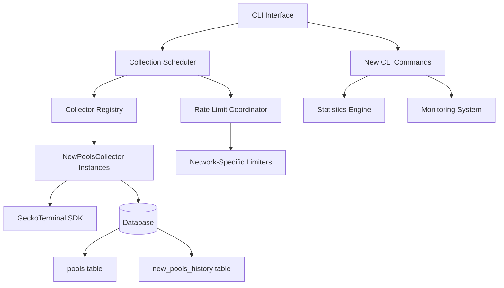
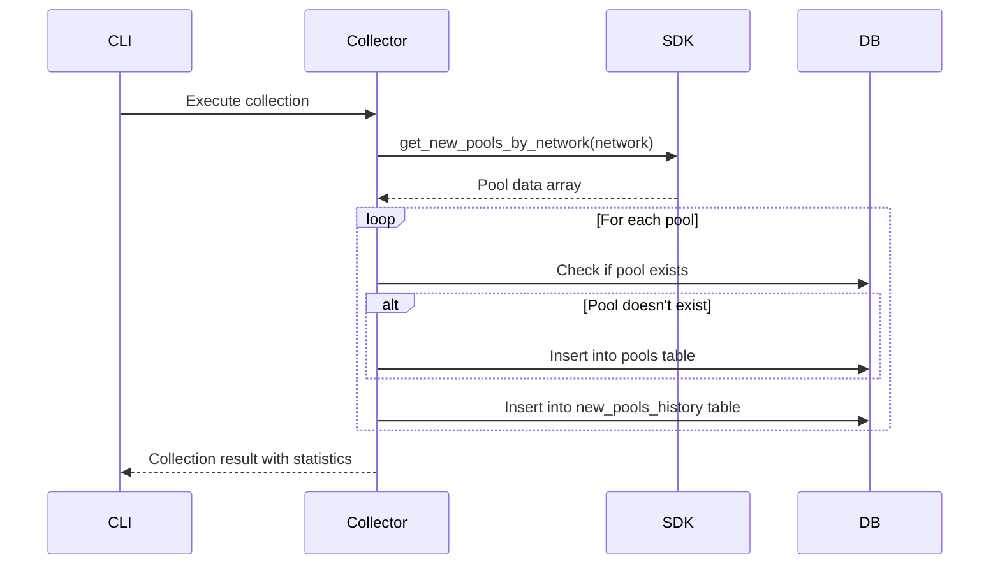

# Design Document

## Overview

This design document outlines the integration of NewPoolsCollector functionality into the existing CLI scheduler infrastructure. The integration leverages the existing rate limiting, monitoring, and scheduling components while adding new CLI commands and collector registration patterns specifically for new pools collection across multiple networks.

The design follows the established patterns in the codebase, extending the existing `cli_with_scheduler.py` to support network-specific new pools collection with comprehensive statistics and monitoring capabilities.

## Architecture

### High-Level Architecture



### Component Integration

The integration extends the existing CLI architecture by:

1. **Collector Registration**: Adding NewPoolsCollector instances to the scheduler's collector registry
2. **Rate Limiting**: Creating network-specific rate limiters within the global coordinator
3. **Command Extension**: Adding new CLI commands while maintaining existing functionality
4. **Data Flow**: Implementing dual-table storage pattern for referential integrity and historical tracking

## Components and Interfaces

### 1. Enhanced CLI Interface

#### New Commands

**collect-new-pools Command**
```python
@cli.command()
@click.option('--config', '-c', default='config.yaml', help='Configuration file path')
@click.option('--network', '-n', default='solana', help='Network to collect pools for')
@click.option('--mock', is_flag=True, help='Use mock clients for testing')
def collect_new_pools(config, network, mock):
    """Run new pools collection for a specific network on-demand."""
```

**new-pools-stats Command**
```python
@cli.command()
@click.option('--config', '-c', default='config.yaml', help='Configuration file path')
@click.option('--network', '-n', help='Filter by network (optional)')
@click.option('--limit', '-l', default=10, help='Number of recent records to show')
def new_pools_stats(config, network, limit):
    """Display comprehensive statistics and recent data from new pools collection."""
```

#### Enhanced Existing Commands

- **status**: Extended to show new pools collectors
- **run-once**: Enhanced to support new pools collector execution
- **rate-limit-status**: Extended to show new pools rate limiters
- **reset-rate-limiter**: Enhanced to reset new pools rate limiters

### 2. Collector Registration System

#### Network-Specific Collector Configuration

```python
collectors_config = [
    ("dex_monitoring", DEXMonitoringCollector, "1h", True),
    ("new_pools_solana", NewPoolsCollector, "30m", True, {"network": "solana"}),
    ("new_pools_ethereum", NewPoolsCollector, "30m", False, {"network": "ethereum"}),
    ("top_pools", TopPoolsCollector, config.intervals.top_pools_monitoring, True),
    # ... other collectors
]
```

#### Registration Process

1. **Collector Instantiation**: Create NewPoolsCollector with network parameter
2. **Rate Limiter Assignment**: Assign network-specific rate limiter
3. **Scheduler Registration**: Register with configurable interval and enable/disable flag
4. **Metadata Tracking**: Initialize metadata tracking for collection statistics

### 3. Data Storage Architecture

#### Dual-Table Storage Pattern

**Pools Table (Referential Integrity)**
- Purpose: Maintain unique pool records for foreign key relationships
- Fields: id, address, name, dex_id, base_token_id, quote_token_id, reserve_usd, created_at, last_updated
- Behavior: Insert only if pool doesn't exist

**New Pools History Table (Historical Tracking)**
- Purpose: Comprehensive historical records for predictive modeling
- Fields: All market data including prices, volumes, transactions, FDV, market cap
- Behavior: Always insert new record for each collection run

#### Data Flow



### 4. Rate Limiting Integration

#### Network-Specific Rate Limiters

Each network gets its own rate limiter instance:
- `new_pools_solana`: Dedicated limiter for Solana network
- `new_pools_ethereum`: Dedicated limiter for Ethereum network
- Additional networks can be added with their own limiters

#### Rate Limiting Flow

1. **Pre-Collection Check**: Verify rate limiter status before API calls
2. **Request Tracking**: Track API requests against network-specific limits
3. **Backoff Handling**: Apply exponential backoff on rate limit hits
4. **Circuit Breaker**: Prevent cascading failures with circuit breaker pattern

### 5. Statistics and Monitoring Engine

#### Statistics Collection

**Database Statistics**
- Total pools count
- Total history records count
- Network distribution analysis
- DEX distribution analysis

**Collection Activity**
- Recent collection runs
- Success/failure rates
- Performance metrics
- Error tracking

#### Monitoring Integration

- **Metadata Tracking**: Collection statistics and performance metrics
- **Execution History**: Historical execution tracking
- **Performance Metrics**: Response times and throughput
- **Error Monitoring**: Error rates and failure analysis

## Data Models

### Pool Data Structure (from SDK)

```python
{
    "id": "solana_jbZxBTj6DKvTzjLSHN1ZTgj1Ef7f7n7ZunopXvGVNrU",
    "type": "pool",
    "attributes": {
        "name": "TTT / SOL",
        "base_token_price_usd": "0.00000624",
        "base_token_price_native_currency": "0.00000003",
        "quote_token_price_usd": "215.4862309",
        "quote_token_price_native_currency": "1",
        "address": "jbZxBTj6DKvTzjLSHN1ZTgj1Ef7f7n7ZunopXvGVNrU",
        "reserve_in_usd": "4943.8875",
        "pool_created_at": "2025-09-09T21:27:52Z",
        "fdv_usd": "6235.663542",
        "market_cap_usd": null,
        "price_change_percentage_h1": "1.758",
        "price_change_percentage_h24": "1.758",
        "transactions_h1_buys": "5",
        "transactions_h1_sells": "4",
        "transactions_h24_buys": "5",
        "transactions_h24_sells": "4",
        "volume_usd_h24": "793.735054",
        "dex_id": "pump-fun",
        "base_token_id": "solana_9oZzjkRV6bjKP5EHnnavgNkjj55LTn9gKNkeZiXepump",
        "quote_token_id": "solana_So11111111111111111111111111111111111111112",
        "network_id": "solana"
    }
}
```

### Database Schema

#### Pools Table
```sql
CREATE TABLE pools (
    id VARCHAR(100) PRIMARY KEY,
    address VARCHAR(100) NOT NULL,
    name VARCHAR(200),
    dex_id VARCHAR(50),
    base_token_id VARCHAR(100),
    quote_token_id VARCHAR(100),
    reserve_usd DECIMAL(20,4),
    created_at DATETIME,
    last_updated DATETIME DEFAULT CURRENT_TIMESTAMP ON UPDATE CURRENT_TIMESTAMP
);
```

#### New Pools History Table
```sql
CREATE TABLE new_pools_history (
    id INTEGER PRIMARY KEY AUTO_INCREMENT,
    pool_id VARCHAR(255) NOT NULL,
    type VARCHAR(20) DEFAULT 'pool',
    name VARCHAR(255),
    base_token_price_usd DECIMAL(20,10),
    base_token_price_native_currency DECIMAL(20,10),
    quote_token_price_usd DECIMAL(20,10),
    quote_token_price_native_currency DECIMAL(20,10),
    address VARCHAR(255),
    reserve_in_usd DECIMAL(20,4),
    pool_created_at DATETIME,
    fdv_usd DECIMAL(20,4),
    market_cap_usd DECIMAL(20,4),
    price_change_percentage_h1 DECIMAL(10,4),
    price_change_percentage_h24 DECIMAL(10,4),
    transactions_h1_buys INTEGER,
    transactions_h1_sells INTEGER,
    transactions_h24_buys INTEGER,
    transactions_h24_sells INTEGER,
    volume_usd_h24 DECIMAL(20,4),
    dex_id VARCHAR(100),
    base_token_id VARCHAR(255),
    quote_token_id VARCHAR(255),
    network_id VARCHAR(50),
    collected_at DATETIME DEFAULT CURRENT_TIMESTAMP,
    UNIQUE KEY uq_new_pools_history_pool_collected (pool_id, collected_at)
);
```

## Error Handling

### Error Categories

1. **API Errors**
   - Rate limiting (429 responses)
   - Network timeouts
   - Invalid responses
   - Authentication failures

2. **Data Validation Errors**
   - Missing required fields
   - Invalid data types
   - Constraint violations

3. **Database Errors**
   - Connection failures
   - Constraint violations
   - Transaction failures

### Error Handling Strategy

#### Graceful Degradation
- Continue processing valid records when some records fail
- Log detailed error information for troubleshooting
- Provide clear error messages to operators

#### Rate Limiting Error Handling
- Detect rate limiting errors (429 status codes)
- Apply exponential backoff with jitter
- Activate circuit breaker on consecutive failures
- Provide clear guidance on recovery actions

#### Data Validation Error Handling
- Validate data structure before processing
- Skip invalid records with detailed logging
- Continue processing remaining valid records
- Report validation statistics in collection results

## Testing Strategy

### Unit Testing

1. **CLI Command Testing**
   - Test new command interfaces
   - Verify parameter handling
   - Mock external dependencies

2. **Collector Integration Testing**
   - Test collector registration
   - Verify rate limiter assignment
   - Test data processing logic

3. **Statistics Engine Testing**
   - Test statistics calculation
   - Verify filtering logic
   - Test output formatting

### Integration Testing

1. **End-to-End CLI Testing**
   - Test complete command execution
   - Verify database interactions
   - Test error handling paths

2. **Rate Limiting Integration**
   - Test rate limiter coordination
   - Verify backoff behavior
   - Test circuit breaker activation

3. **Database Integration**
   - Test dual-table storage
   - Verify constraint handling
   - Test transaction rollback

### Performance Testing

1. **Collection Performance**
   - Test with large datasets
   - Measure processing times
   - Verify memory usage

2. **Database Performance**
   - Test bulk insert operations
   - Verify index effectiveness
   - Test concurrent access patterns

## Configuration

### Network Configuration

```yaml
new_pools:
  networks:
    solana:
      enabled: true
      interval: "30m"
      rate_limit_key: "new_pools_solana"
    ethereum:
      enabled: false
      interval: "30m"
      rate_limit_key: "new_pools_ethereum"
```

### Rate Limiting Configuration

```yaml
rate_limiting:
  requests_per_minute: 30
  daily_limit: 10000
  state_file_dir: "./rate_limit_state"
  network_specific:
    new_pools_solana:
      requests_per_minute: 10
      daily_limit: 3000
    new_pools_ethereum:
      requests_per_minute: 10
      daily_limit: 3000
```

## Security Considerations

### API Key Management
- Secure storage of API credentials
- Environment variable configuration
- Rotation capability

### Rate Limiting Security
- Prevent API abuse
- Implement circuit breakers
- Monitor usage patterns

### Data Validation
- Input sanitization
- SQL injection prevention
- Data type validation

## Performance Considerations

### Database Optimization
- Proper indexing on frequently queried columns
- Batch insert operations for historical records
- Connection pooling for concurrent access

### Memory Management
- Stream processing for large datasets
- Efficient data structures
- Garbage collection optimization

### API Efficiency
- Minimize API calls through batching
- Implement caching where appropriate
- Use connection pooling for HTTP requests

## Deployment Considerations

### Migration Strategy
- Database schema migrations
- Backward compatibility maintenance
- Rollback procedures

### Monitoring and Alerting
- Collection success/failure rates
- Rate limiting status monitoring
- Database performance metrics
- Error rate thresholds

### Operational Procedures
- Collection scheduling management
- Rate limiter reset procedures
- Database maintenance tasks
- Error investigation workflows