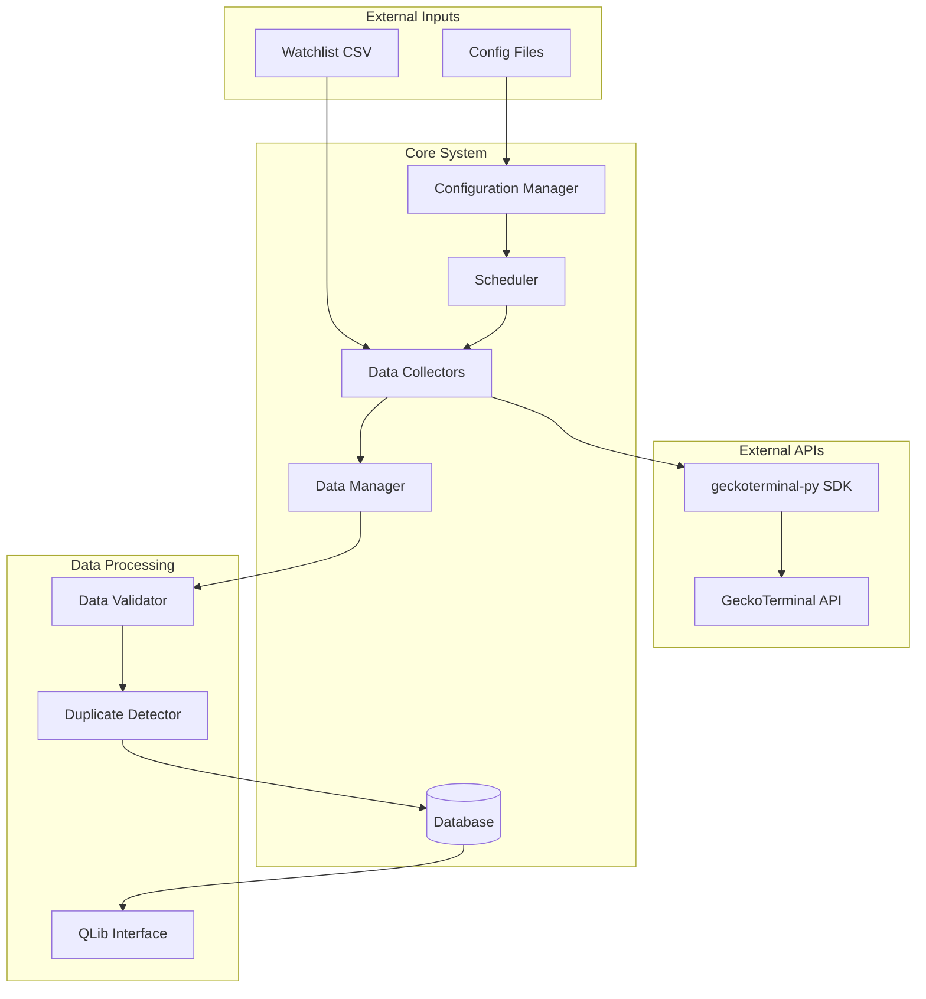

# Design Document

## Overview

The GeckoTerminal Data Collector is a Python-based system designed to collect, store, and manage cryptocurrency trading data from the GeckoTerminal API for Solana DEXes. The system follows a modular architecture with separate components for data collection, storage, configuration management, and QLib integration. It supports both real-time monitoring and historical data collection with robust error handling and data integrity controls.

## Architecture

### High-Level Architecture



### Component Architecture

The system is organized into the following main components:

1. **Configuration Management**: Centralized configuration handling
2. **Data Collection Layer**: Modular collectors for different data types
3. **Data Storage Layer**: Database abstraction with integrity controls
4. **Scheduling System**: Configurable interval-based execution
5. **QLib Integration**: Export interface for predictive modeling

## Components and Interfaces

### 1. Configuration Manager

**Purpose**: Centralized configuration management with hot-reloading support

**Key Classes**:
- `ConfigManager`: Main configuration handler
- `CollectionConfig`: Data collection settings
- `DatabaseConfig`: Database connection settings

**Configuration Schema**:
```yaml
# config.yaml
dexes:
  targets: ["heaven", "pumpswap"]
  network: "solana"

intervals:
  top_pools_monitoring: "1h"
  ohlcv_collection: "1h"
  trade_collection: "30m"
  watchlist_check: "1h"

thresholds:
  min_trade_volume_usd: 100
  max_retries: 3
  rate_limit_delay: 1.0

timeframes:
  ohlcv_default: "1h"
  supported: ["1m", "5m", "15m", "1h", "4h", "12h", "1d"]

database:
  url: "sqlite:///gecko_data.db"
  pool_size: 10
  echo: false

api:
  base_url: "https://api.geckoterminal.com/api/v2"
  timeout: 30
  max_concurrent: 5
```

### 2. Data Collection Layer

**Base Collector Interface**:
```python
class BaseDataCollector(ABC):
    def __init__(self, config: CollectionConfig, db_manager: DatabaseManager):
        self.config = config
        self.db_manager = db_manager
        self.client = GeckoTerminalAsyncClient()
    
    @abstractmethod
    async def collect(self) -> CollectionResult:
        pass
    
    @abstractmethod
    def get_collection_key(self) -> str:
        pass
```

**Collector Implementations**:

1. **DEXMonitoringCollector**: Monitors available DEXes
2. **TopPoolsCollector**: Collects top pools by DEX
3. **WatchlistCollector**: Processes watchlist tokens
4. **OHLCVCollector**: Collects OHLCV data
5. **TradeCollector**: Collects trade data
6. **HistoricalOHLCVCollector**: Fetches historical data via direct API

### 3. Data Storage Layer

**Database Schema**:

```sql
-- DEX information
CREATE TABLE dexes (
    id VARCHAR(50) PRIMARY KEY,
    name VARCHAR(100) NOT NULL,
    network VARCHAR(20) NOT NULL,
    last_updated TIMESTAMP DEFAULT CURRENT_TIMESTAMP
);

-- Pool information
CREATE TABLE pools (
    id VARCHAR(100) PRIMARY KEY,
    address VARCHAR(100) NOT NULL,
    name VARCHAR(200),
    dex_id VARCHAR(50) NOT NULL,
    base_token_id VARCHAR(100),
    quote_token_id VARCHAR(100),
    reserve_usd DECIMAL(20,8),
    created_at TIMESTAMP,
    last_updated TIMESTAMP DEFAULT CURRENT_TIMESTAMP,
    FOREIGN KEY (dex_id) REFERENCES dexes(id)
);

-- Token information
CREATE TABLE tokens (
    id VARCHAR(100) PRIMARY KEY,
    address VARCHAR(100) NOT NULL,
    name VARCHAR(200),
    symbol VARCHAR(20),
    decimals INTEGER,
    network VARCHAR(20) NOT NULL,
    last_updated TIMESTAMP DEFAULT CURRENT_TIMESTAMP
);

-- OHLCV data
CREATE TABLE ohlcv_data (
    id BIGINT PRIMARY KEY AUTOINCREMENT,
    pool_id VARCHAR(100) NOT NULL,
    timeframe VARCHAR(10) NOT NULL,
    timestamp BIGINT NOT NULL,
    open_price DECIMAL(30,18) NOT NULL,
    high_price DECIMAL(30,18) NOT NULL,
    low_price DECIMAL(30,18) NOT NULL,
    close_price DECIMAL(30,18) NOT NULL,
    volume_usd DECIMAL(20,8) NOT NULL,
    datetime TIMESTAMP NOT NULL,
    created_at TIMESTAMP DEFAULT CURRENT_TIMESTAMP,
    UNIQUE(pool_id, timeframe, timestamp),
    FOREIGN KEY (pool_id) REFERENCES pools(id)
);

-- Trade data
CREATE TABLE trades (
    id VARCHAR(200) PRIMARY KEY,
    pool_id VARCHAR(100) NOT NULL,
    block_number BIGINT,
    tx_hash VARCHAR(100),
    tx_from_address VARCHAR(100),
    from_token_amount DECIMAL(30,18),
    to_token_amount DECIMAL(30,18),
    price_usd DECIMAL(30,18),
    volume_usd DECIMAL(20,8),
    side VARCHAR(10),
    block_timestamp TIMESTAMP,
    created_at TIMESTAMP DEFAULT CURRENT_TIMESTAMP,
    FOREIGN KEY (pool_id) REFERENCES pools(id)
);

-- Watchlist
CREATE TABLE watchlist (
    id BIGINT PRIMARY KEY AUTOINCREMENT,
    pool_id VARCHAR(100) NOT NULL,
    token_symbol VARCHAR(20),
    token_name VARCHAR(200),
    network_address VARCHAR(100),
    added_at TIMESTAMP DEFAULT CURRENT_TIMESTAMP,
    is_active BOOLEAN DEFAULT TRUE,
    UNIQUE(pool_id),
    FOREIGN KEY (pool_id) REFERENCES pools(id)
);

-- Collection metadata for tracking
CREATE TABLE collection_metadata (
    collector_type VARCHAR(50) NOT NULL,
    last_run TIMESTAMP,
    last_success TIMESTAMP,
    run_count INTEGER DEFAULT 0,
    error_count INTEGER DEFAULT 0,
    last_error TEXT,
    PRIMARY KEY (collector_type)
);
```

**Data Manager Interface**:
```python
class DatabaseManager:
    def __init__(self, config: DatabaseConfig):
        self.engine = create_engine(config.url)
        self.session_factory = sessionmaker(bind=self.engine)
    
    async def store_ohlcv_data(self, data: List[OHLCVRecord]) -> int:
        # Implements upsert with duplicate detection
        pass
    
    async def store_trade_data(self, data: List[TradeRecord]) -> int:
        # Implements insert with duplicate prevention
        pass
    
    async def get_data_gaps(self, pool_id: str, timeframe: str, 
                           start: datetime, end: datetime) -> List[Gap]:
        # Identifies missing data intervals
        pass
```

### 4. Scheduling System

**Scheduler Architecture**:
```python
class CollectionScheduler:
    def __init__(self, config: ConfigManager):
        self.config = config
        self.collectors = {}
        self.scheduler = AsyncIOScheduler()
    
    def register_collector(self, collector: BaseDataCollector, 
                          interval: str):
        # Register collector with specified interval
        pass
    
    async def start(self):
        # Start all scheduled collections
        pass
```

**Scheduling Configuration**:
- Top pools monitoring: Every hour
- OHLCV collection: Configurable (default 1h)
- Trade collection: Configurable (default 30m)
- Watchlist processing: Every hour
- Historical backfill: On-demand

### 5. Data Validation and Integrity

**Validation Pipeline**:
```python
class DataValidator:
    def validate_ohlcv(self, data: OHLCVRecord) -> ValidationResult:
        # Validate OHLCV data integrity
        # Check price relationships (high >= low, etc.)
        # Validate timestamp sequences
        pass
    
    def check_continuity(self, pool_id: str, timeframe: str) -> ContinuityReport:
        # Identify gaps in time series data
        # Flag potential data quality issues
        pass
```

**Duplicate Detection**:
- OHLCV: Composite key (pool_id, timeframe, timestamp)
- Trades: Primary key from API response ID
- Pools/Tokens: Address-based deduplication

## Data Models

### Core Data Models

```python
@dataclass
class Pool:
    id: str
    address: str
    name: str
    dex_id: str
    base_token_id: str
    quote_token_id: str
    reserve_usd: Decimal
    created_at: datetime
    
@dataclass
class Token:
    id: str
    address: str
    name: str
    symbol: str
    decimals: int
    network: str
    price_usd: Optional[Decimal] = None
    
@dataclass
class OHLCVRecord:
    pool_id: str
    timeframe: str
    timestamp: int
    open_price: Decimal
    high_price: Decimal
    low_price: Decimal
    close_price: Decimal
    volume_usd: Decimal
    datetime: datetime
    
@dataclass
class TradeRecord:
    id: str
    pool_id: str
    block_number: int
    tx_hash: str
    from_token_amount: Decimal
    to_token_amount: Decimal
    price_usd: Decimal
    volume_usd: Decimal
    side: str
    block_timestamp: datetime
```

### Address Type Handling

The system handles two distinct address types:

1. **Pool Address ("id")**: Used for pool-specific operations
   - Format: `solana_7bqJG2ZdMKbEkgSmfuqNVBvqEvWavgL8UEo33ZqdL3NP`
   - Used in: Watchlist, OHLCV collection, trade collection

2. **Network Address ("base_token_id")**: Token contract address
   - Format: `5LKHMd2rMSRaG9y4iHwSLRtrJ3dCrJ2CytvBeak8pump`
   - Used in: Token information queries

## Error Handling

### Error Handling Strategy

1. **API Rate Limiting**:
   - Exponential backoff with jitter
   - Configurable retry limits
   - Request queuing and throttling

2. **Network Errors**:
   - Automatic retry with circuit breaker pattern
   - Graceful degradation for non-critical operations
   - Comprehensive error logging

3. **Data Validation Errors**:
   - Skip invalid records with logging
   - Continue processing valid data
   - Generate data quality reports

4. **Database Errors**:
   - Transaction rollback on failures
   - Connection pool management
   - Automatic reconnection handling

### Error Recovery

```python
class ErrorHandler:
    def __init__(self, config: ErrorConfig):
        self.max_retries = config.max_retries
        self.backoff_factor = config.backoff_factor
    
    async def with_retry(self, operation: Callable, 
                        context: str) -> Any:
        # Implements exponential backoff retry logic
        pass
    
    def handle_api_error(self, error: APIError, 
                        collector: str) -> RecoveryAction:
        # Determines appropriate recovery action
        pass
```

## Testing Strategy

### Unit Testing
- Individual collector functionality
- Data validation logic
- Database operations
- Configuration management

### Integration Testing
- End-to-end data collection workflows
- API integration with mock responses
- Database schema validation
- Error handling scenarios

### Performance Testing
- Concurrent collection performance
- Database query optimization
- Memory usage under load
- API rate limit compliance

### Test Data Strategy
- Use provided CSV files as test fixtures
- Mock API responses for consistent testing
- Database seeding for integration tests
- Watchlist simulation for workflow testing

## QLib Integration

### QLib Compatibility Layer

```python
class QLibExporter:
    def __init__(self, db_manager: DatabaseManager):
        self.db_manager = db_manager
    
    def export_ohlcv_data(self, symbols: List[str], 
                         start_date: datetime, 
                         end_date: datetime) -> pd.DataFrame:
        # Export data in QLib-compatible format
        # Columns: datetime, symbol, open, high, low, close, volume
        pass
    
    def get_symbol_list(self) -> List[str]:
        # Return available symbols for QLib
        pass
```

### Data Format Compatibility

Following the QLib crypto collector pattern:
- Date-indexed DataFrames
- Symbol-based organization
- Standardized column naming
- Timezone handling (UTC)
- Missing data interpolation options

## Deployment and Operations

### Configuration Management
- Environment-based configuration
- Hot-reloading for non-critical settings
- Configuration validation on startup
- Secrets management for API keys

### Monitoring and Logging
- Structured logging with correlation IDs
- Collection metrics and dashboards
- Data quality monitoring
- Alert system for failures

### Scalability Considerations
- Horizontal scaling via multiple instances
- Database partitioning by time/symbol
- Async processing for I/O operations
- Configurable concurrency limits

This design provides a robust, scalable foundation for collecting and managing GeckoTerminal data while maintaining compatibility with QLib for predictive modeling workflows.