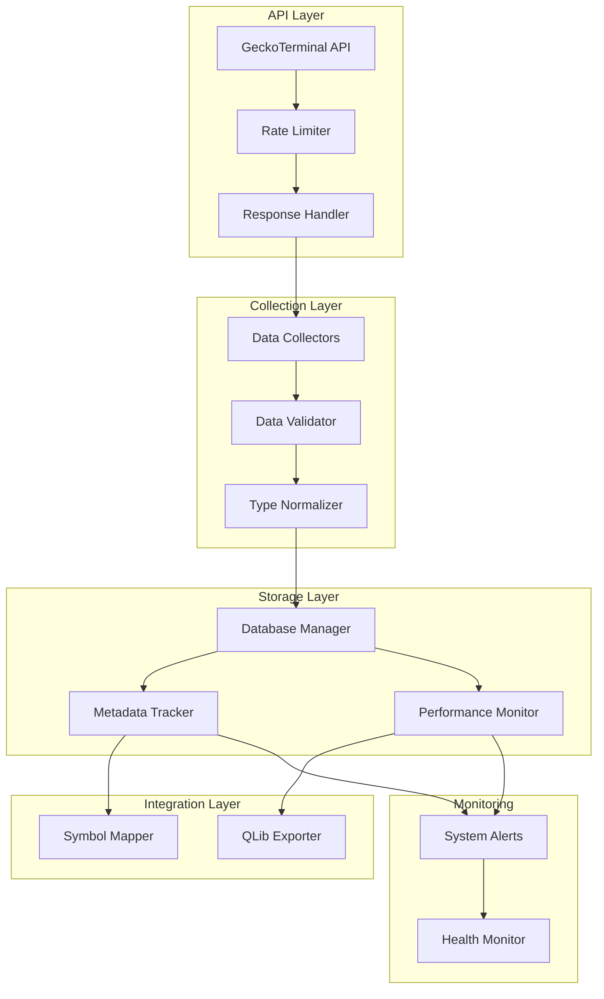

# Design Document

## Overview

This design addresses critical systemic issues in the GeckoTerminal data collection system by implementing robust API rate limiting, comprehensive database population, consistent data validation, enhanced test coverage, and integration of the QLib symbol case-sensitivity fix. The solution ensures reliable data collection while maintaining system performance and data integrity.

## Architecture

### Current Problem Analysis

Based on the business requirements and test analysis, the system has these critical issues:

1. **API Rate Limiting**: GeckoTerminal API limits (24-hour quotas) cause collection failures
2. **Data Type Inconsistency**: DEX monitoring expects List but receives DataFrame, causing validation failures
3. **Missing Database Records**: Metadata tables aren't being populated during collection runs
4. **Test Coverage Gaps**: CLI script rate limiter logic doesn't work, integration tests fail
5. **OHLCV Collection Issues**: Data parsing and storage problems prevent proper OHLCV capture

### Proposed Solution Architecture



## Components and Interfaces

### 1. Enhanced Rate Limiter

**Purpose:** Implement robust API rate limiting with exponential backoff and system-wide coordination.

**Key Features:**
- Exponential backoff with jitter for 429 responses
- Global rate limit tracking across all collectors
- Configurable rate limits per endpoint
- Circuit breaker pattern for persistent failures

**Implementation Strategy:**
```python
class EnhancedRateLimiter:
    def __init__(self, requests_per_minute=60, daily_limit=10000):
        self.requests_per_minute = requests_per_minute
        self.daily_limit = daily_limit
        self.request_history = deque()
        self.daily_count = 0
        self.last_reset = datetime.now().date()
        self.backoff_until = None
    
    async def acquire(self, endpoint: str = "default"):
        # Check daily limit
        if self._check_daily_reset():
            self.daily_count = 0
        
        if self.daily_count >= self.daily_limit:
            raise RateLimitExceededError("Daily API limit reached")
        
        # Check per-minute limit
        await self._wait_for_rate_limit()
        
        # Check if in backoff period
        if self.backoff_until and datetime.now() < self.backoff_until:
            wait_time = (self.backoff_until - datetime.now()).total_seconds()
            await asyncio.sleep(wait_time)
        
        self.request_history.append(datetime.now())
        self.daily_count += 1
    
    def handle_rate_limit_response(self, response_headers):
        # Extract rate limit info from headers
        retry_after = response_headers.get('Retry-After', 60)
        self.backoff_until = datetime.now() + timedelta(seconds=int(retry_after))
        
        # Exponential backoff with jitter
        backoff_time = min(retry_after * (2 ** self.consecutive_failures), 300)
        jitter = random.uniform(0.1, 0.3) * backoff_time
        self.backoff_until += timedelta(seconds=jitter)
```

### 2. Data Type Normalizer

**Purpose:** Ensure consistent data types across all collectors and handle DataFrame/List conversion issues.

**Key Methods:**
- `normalize_response_data(data) -> List[Dict]`: Convert any response format to standard list
- `validate_data_structure(data, expected_type) -> ValidationResult`: Validate data structure
- `convert_dataframe_to_records(df) -> List[Dict]`: Handle pandas DataFrame conversion

**Implementation Strategy:**
```python
class DataTypeNormalizer:
    @staticmethod
    def normalize_response_data(data) -> List[Dict]:
        """Convert API response data to consistent List[Dict] format."""
        if isinstance(data, pd.DataFrame):
            return data.to_dict('records')
        elif isinstance(data, list):
            return data
        elif isinstance(data, dict):
            # Handle single record responses
            return [data]
        else:
            raise ValueError(f"Unsupported data type: {type(data)}")
    
    @staticmethod
    def validate_expected_structure(data, collector_type: str) -> ValidationResult:
        """Validate data structure matches collector expectations."""
        errors = []
        warnings = []
        
        if collector_type == "dex_monitoring":
            if not isinstance(data, list):
                errors.append(f"DEX data must be a list, got {type(data)}")
        
        return ValidationResult(
            is_valid=len(errors) == 0,
            errors=errors,
            warnings=warnings
        )
```

### 3. Enhanced Database Population

**Purpose:** Ensure all metadata and performance tables are properly populated during collection runs.

**New Database Methods:**
- `store_collection_metadata(collector_type, start_time, end_time, status)`
- `store_execution_history(collector_type, result, duration, errors)`
- `store_performance_metrics(collector_type, metrics)`
- `create_system_alert(alert_type, message, severity)`

**Implementation Strategy:**
```python
class EnhancedDatabaseManager(SQLAlchemyDatabaseManager):
    async def store_collection_run(self, collector_type: str, result: CollectionResult):
        """Store comprehensive collection run information."""
        async with self.get_session() as session:
            # Store collection metadata
            metadata = CollectionMetadata(
                collector_type=collector_type,
                start_time=result.collection_time,
                end_time=datetime.now(),
                status='success' if result.success else 'failed',
                records_collected=result.records_collected,
                errors=json.dumps(result.errors) if result.errors else None
            )
            session.add(metadata)
            
            # Store execution history
            execution = ExecutionHistory(
                collector_type=collector_type,
                execution_time=result.collection_time,
                duration=(datetime.now() - result.collection_time).total_seconds(),
                success=result.success,
                error_details=json.dumps(result.errors) if result.errors else None
            )
            session.add(execution)
            
            # Store performance metrics
            if hasattr(result, 'metadata') and result.metadata:
                metrics = PerformanceMetrics(
                    collector_type=collector_type,
                    timestamp=datetime.now(),
                    api_calls_made=result.metadata.get('api_calls', 0),
                    processing_time=result.metadata.get('processing_time', 0),
                    memory_usage=result.metadata.get('memory_usage', 0)
                )
                session.add(metrics)
            
            # Create system alerts for failures
            if not result.success:
                alert = SystemAlert(
                    alert_type='collection_failure',
                    message=f"Collection failed for {collector_type}: {'; '.join(result.errors)}",
                    severity='error',
                    timestamp=datetime.now(),
                    resolved=False
                )
                session.add(alert)
            
            await session.commit()
```

### 4. OHLCV Collection Enhancement

**Purpose:** Fix OHLCV data parsing and storage issues to ensure proper data capture.

**Key Improvements:**
- Enhanced response parsing with better error handling
- Proper timestamp conversion and validation
- Bulk insert optimization for large datasets
- Data quality validation before storage

**Implementation Strategy:**
```python
class EnhancedOHLCVCollector(OHLCVCollector):
    def _parse_ohlcv_response(self, response: Dict, pool_id: str, timeframe: str) -> List[OHLCVData]:
        """Enhanced OHLCV response parsing with better error handling."""
        try:
            ohlcv_list = response.get('data', {}).get('attributes', {}).get('ohlcv_list', [])
            
            if not ohlcv_list:
                logger.warning(f"No OHLCV data found for pool {pool_id}")
                return []
            
            records = []
            for ohlcv_entry in ohlcv_list:
                if len(ohlcv_entry) != 6:
                    logger.warning(f"Invalid OHLCV entry format: {ohlcv_entry}")
                    continue
                
                timestamp, open_price, high_price, low_price, close_price, volume = ohlcv_entry
                
                # Validate data quality
                if any(price <= 0 for price in [open_price, high_price, low_price, close_price]):
                    logger.warning(f"Invalid price data for {pool_id} at {timestamp}")
                    continue
                
                record = OHLCVData(
                    pool_id=pool_id,
                    timestamp=datetime.fromtimestamp(timestamp),
                    timeframe=timeframe,
                    open_price=float(open_price),
                    high_price=float(high_price),
                    low_price=float(low_price),
                    close_price=float(close_price),
                    volume_usd=float(volume)
                )
                records.append(record)
            
            return records
            
        except Exception as e:
            logger.error(f"Error parsing OHLCV response for {pool_id}: {e}")
            return []
```

### 5. Integrated Symbol Mapper

**Purpose:** Integrate the existing QLib symbol case-sensitivity fix into the enhanced system.

**Integration Points:**
- Enhanced database manager uses SymbolMapper for all symbol operations
- QLib exporter leverages SymbolMapper for case-insensitive lookups
- All collectors use consistent symbol generation through SymbolMapper

**Implementation Strategy:**
```python
class IntegratedSymbolMapper(SymbolMapper):
    def __init__(self, db_manager: EnhancedDatabaseManager):
        super().__init__()
        self.db_manager = db_manager
    
    async def populate_cache_from_database(self):
        """Populate symbol cache from existing database records."""
        pools = await self.db_manager.get_all_pools()
        for pool in pools:
            symbol = self.generate_symbol(pool)
            self._symbol_to_pool_cache[symbol] = pool
            self._normalized_to_symbol_cache[symbol.lower()] = symbol
    
    async def lookup_pool_with_fallback(self, symbol: str) -> Optional[Pool]:
        """Enhanced lookup with database fallback and caching."""
        # Try cache first
        pool = self.lookup_pool(symbol)
        if pool:
            return pool
        
        # Database fallback
        pool = await self.db_manager.get_pool_by_symbol(symbol)
        if pool:
            # Update cache
            generated_symbol = self.generate_symbol(pool)
            self._symbol_to_pool_cache[generated_symbol] = pool
            self._normalized_to_symbol_cache[generated_symbol.lower()] = generated_symbol
            return pool
        
        return None
```

## Data Models

### Enhanced Database Schema

**New Tables:**
```sql
-- Collection metadata tracking
CREATE TABLE collection_metadata (
    id SERIAL PRIMARY KEY,
    collector_type VARCHAR(100) NOT NULL,
    start_time TIMESTAMP NOT NULL,
    end_time TIMESTAMP,
    status VARCHAR(20) NOT NULL,
    records_collected INTEGER DEFAULT 0,
    errors TEXT,
    created_at TIMESTAMP DEFAULT CURRENT_TIMESTAMP
);

-- Execution history tracking
CREATE TABLE execution_history (
    id SERIAL PRIMARY KEY,
    collector_type VARCHAR(100) NOT NULL,
    execution_time TIMESTAMP NOT NULL,
    duration FLOAT,
    success BOOLEAN NOT NULL,
    error_details TEXT,
    created_at TIMESTAMP DEFAULT CURRENT_TIMESTAMP
);

-- Performance metrics
CREATE TABLE performance_metrics (
    id SERIAL PRIMARY KEY,
    collector_type VARCHAR(100) NOT NULL,
    timestamp TIMESTAMP NOT NULL,
    api_calls_made INTEGER DEFAULT 0,
    processing_time FLOAT DEFAULT 0,
    memory_usage BIGINT DEFAULT 0,
    rate_limit_hits INTEGER DEFAULT 0,
    created_at TIMESTAMP DEFAULT CURRENT_TIMESTAMP
);

-- System alerts
CREATE TABLE system_alerts (
    id SERIAL PRIMARY KEY,
    alert_type VARCHAR(50) NOT NULL,
    message TEXT NOT NULL,
    severity VARCHAR(20) NOT NULL,
    timestamp TIMESTAMP NOT NULL,
    resolved BOOLEAN DEFAULT FALSE,
    resolved_at TIMESTAMP,
    created_at TIMESTAMP DEFAULT CURRENT_TIMESTAMP
);
```

## Error Handling

### Enhanced Error Recovery

**Rate Limit Error Handling:**
1. **Immediate Response**: Log 429 errors and extract retry-after headers
2. **Exponential Backoff**: Implement jittered exponential backoff
3. **Circuit Breaker**: Open circuit after consecutive failures
4. **System Alerts**: Create alerts for persistent rate limiting issues

**Data Validation Error Handling:**
1. **Type Conversion**: Attempt automatic type conversion before failing
2. **Partial Success**: Store valid records even if some fail validation
3. **Detailed Logging**: Log specific validation failures with data samples
4. **Recovery Suggestions**: Provide actionable error messages

**Database Error Handling:**
1. **Transaction Rollback**: Ensure data consistency on failures
2. **Retry Logic**: Retry transient database errors
3. **Connection Pooling**: Manage database connections efficiently
4. **Deadlock Detection**: Handle database deadlocks gracefully

## Testing Strategy

### Enhanced Test Coverage

**Integration Tests:**
1. **End-to-End Workflow**: Test complete data flow from API to database
2. **Rate Limit Simulation**: Mock API rate limiting scenarios
3. **Data Type Validation**: Test all data type conversion scenarios
4. **Database Population**: Verify all metadata tables are populated

**Performance Tests:**
1. **Load Testing**: Test system under high collection loads
2. **Memory Usage**: Monitor memory consumption during large collections
3. **API Efficiency**: Measure API usage optimization
4. **Database Performance**: Test bulk insert performance

**CLI Integration Tests:**
1. **Scheduler Integration**: Test CLI with scheduler functionality
2. **Rate Limiter Validation**: Verify rate limiter works in CLI context
3. **Error Recovery**: Test error recovery in CLI environment
4. **Configuration Loading**: Test various configuration scenarios

### Test Data Management

**Fixture Standardization:**
- Convert CSV fixtures to JSON format for consistency
- Create comprehensive mock API responses
- Standardize test data across all collectors
- Implement fixture validation utilities

## Implementation Phases

### Phase 1: Core Infrastructure (Priority: Critical)
- Implement enhanced rate limiter with exponential backoff
- Fix data type normalization issues
- Enhance database manager with metadata population
- Create comprehensive error handling framework

### Phase 2: Data Collection Fixes (Priority: High)
- Fix OHLCV collection and parsing issues
- Resolve DEX monitoring data validation problems
- Implement proper response handling across all collectors
- Add system alert generation for failures

### Phase 3: Symbol Mapper Integration (Priority: Medium)
- Integrate existing SymbolMapper into enhanced system
- Update QLib exporter to use integrated symbol mapping
- Ensure backward compatibility with existing workflows
- Add comprehensive symbol validation

### Phase 4: Test Coverage Enhancement (Priority: High)
- Create comprehensive integration test suite
- Fix CLI script rate limiter issues
- Implement performance testing framework
- Standardize test fixtures and mock data

### Phase 5: Monitoring and Optimization (Priority: Medium)
- Implement comprehensive system monitoring
- Add performance optimization features
- Create operational dashboards
- Implement automated health checks

## Performance Considerations

### API Efficiency
- Implement request batching where possible
- Use connection pooling for HTTP requests
- Cache frequently accessed data
- Optimize API call patterns to minimize rate limit hits

### Database Optimization
- Use bulk insert operations for large datasets
- Implement proper indexing strategy
- Optimize query patterns for metadata tables
- Use connection pooling for database access

### Memory Management
- Implement streaming data processing for large collections
- Use lazy loading for database queries
- Optimize data structure usage
- Implement proper garbage collection strategies

## Security Considerations

### API Security
- Secure API key storage and rotation
- Implement request signing where required
- Use HTTPS for all API communications
- Rate limit internal API usage to prevent abuse

### Database Security
- Use parameterized queries to prevent SQL injection
- Implement proper access controls
- Encrypt sensitive data at rest
- Audit database access and modifications

### System Security
- Validate all input data before processing
- Implement proper logging without exposing sensitive data
- Use secure configuration management
- Implement proper error handling without information leakage