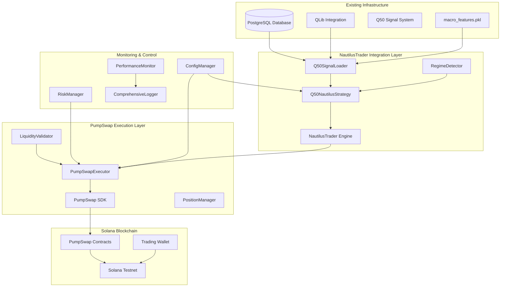
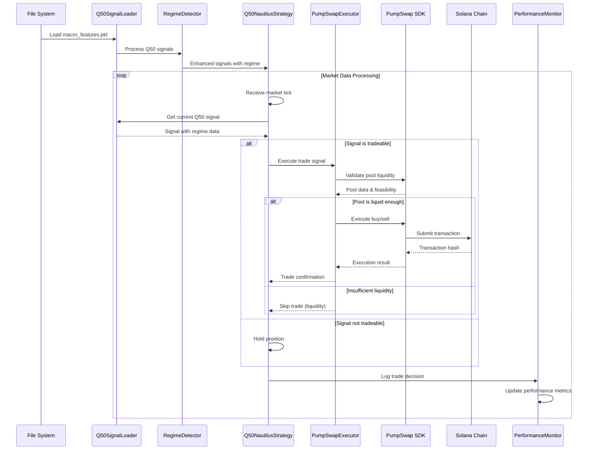

# Design Document

## Overview

This design document outlines the architecture for integrating our proven Q50 quantile trading system with NautilusTrader and PumpSwap DEX execution. The design leverages our existing infrastructure (PostgreSQL database, QLib integration, signal analysis) while adding professional-grade trading execution capabilities through NautilusTrader and real Solana DEX trading via PumpSwap SDK.

The system maintains our existing 1.327 Sharpe ratio performance characteristics while extending beyond paper trading to actual blockchain execution, providing a comprehensive validation of both technical feasibility and real-world trading performance.

## Architecture

### System Overview



### Data Flow Architecture



## Components and Interfaces

### Q50SignalLoader

**Purpose:** Bridge between existing Q50 system and NautilusTrader
**Key Responsibilities:**
- Load signals from `macro_features.pkl`
- Provide timestamp-based signal retrieval with 5-minute tolerance
- Validate signal completeness and quality
- Interface with existing PostgreSQL database

```python
class Q50SignalLoader:
    def __init__(self, config: Dict[str, Any]):
        self.features_path = config['q50']['features_path']
        self.db_connection = config['database']
        self.signals_df = None
        self.last_loaded = None
    
    async def load_signals(self) -> bool:
        """Load Q50 signals from macro_features.pkl"""
        
    async def get_signal_for_timestamp(self, timestamp: pd.Timestamp) -> Optional[Dict]:
        """Get Q50 signal with 5-minute tolerance"""
        
    def validate_signal_columns(self, df: pd.DataFrame) -> bool:
        """Validate required Q50 columns are present"""
        required_columns = [
            'q10', 'q50', 'q90', 'vol_raw', 'vol_risk', 
            'prob_up', 'economically_significant', 'high_quality', 'tradeable'
        ]
        return all(col in df.columns for col in required_columns)
```

### RegimeDetector

**Purpose:** Implement variance-based regime classification using existing indicators
**Key Responsibilities:**
- Classify volatility regimes using vol_risk percentiles
- Apply regime-specific threshold adjustments
- Integrate with existing technical indicators

```python
class RegimeDetector:
    def __init__(self, config: Dict[str, Any]):
        self.vol_risk_percentiles = {
            'low': 0.30,
            'high': 0.70,
            'extreme': 0.90
        }
        self.regime_multipliers = config['regime_multipliers']
    
    def classify_regime(self, signal_data: Dict) -> Dict:
        """Classify volatility regime and apply adjustments"""
        vol_risk = signal_data.get('vol_risk', 0)
        
        if vol_risk <= self.vol_risk_percentiles['low']:
            regime = 'low_variance'
            threshold_adjustment = -0.30
        elif vol_risk <= self.vol_risk_percentiles['high']:
            regime = 'medium_variance'
            threshold_adjustment = 0.0
        elif vol_risk <= self.vol_risk_percentiles['extreme']:
            regime = 'high_variance'
            threshold_adjustment = 0.40
        else:
            regime = 'extreme_variance'
            threshold_adjustment = 0.80
            
        return {
            'regime': regime,
            'vol_risk_percentile': vol_risk,
            'threshold_adjustment': threshold_adjustment,
            'regime_multiplier': self.regime_multipliers.get(regime, 1.0)
        }
```

### Q50NautilusStrategy

**Purpose:** Main NautilusTrader strategy implementing Q50 logic
**Key Responsibilities:**
- Inherit from NautilusTrader Strategy base class
- Process market data ticks
- Make trading decisions based on Q50 signals
- Coordinate with PumpSwap execution

```python
from nautilus_trader.trading.strategy import Strategy
from nautilus_trader.model.data.tick import QuoteTick

class Q50NautilusStrategy(Strategy):
    def __init__(self, config):
        super().__init__(config)
        self.signal_loader = Q50SignalLoader(config)
        self.regime_detector = RegimeDetector(config)
        self.pumpswap_executor = PumpSwapExecutor(config)
        self.position_sizer = KellyPositionSizer(config)
        
    async def on_start(self):
        """Initialize strategy and load Q50 signals"""
        await self.signal_loader.load_signals()
        self.log.info("Q50 signals loaded successfully")
        
    async def on_quote_tick(self, tick: QuoteTick):
        """Process market data and execute Q50 signals"""
        current_signal = await self.signal_loader.get_signal_for_timestamp(
            tick.ts_event
        )
        
        if not current_signal:
            return
            
        # Enhance signal with regime analysis
        regime_data = self.regime_detector.classify_regime(current_signal)
        enhanced_signal = {**current_signal, **regime_data}
        
        # Make trading decision
        if enhanced_signal.get('tradeable', False):
            await self._execute_signal(enhanced_signal, tick)
        else:
            self.log.info(f"Signal not tradeable: {enhanced_signal.get('reason', 'Unknown')}")
    
    async def _execute_signal(self, signal: Dict, tick: QuoteTick):
        """Execute trading signal via PumpSwap"""
        q50_value = signal.get('q50', 0)
        
        if q50_value > 0:
            # Long signal
            await self.pumpswap_executor.execute_buy_signal(signal, tick)
        elif q50_value < 0:
            # Short signal (sell existing position)
            await self.pumpswap_executor.execute_sell_signal(signal, tick)
```

### PumpSwapExecutor

**Purpose:** Execute trades via PumpSwap SDK with comprehensive validation
**Key Responsibilities:**
- Interface with PumpSwap SDK
- Validate pool liquidity and execution feasibility
- Manage position sizing with Kelly logic
- Handle transaction execution and monitoring

```python
from pumpswap_sdk.sdk.pumpswap_sdk import PumpSwapSDK

class PumpSwapExecutor:
    def __init__(self, config: Dict[str, Any]):
        self.sdk = PumpSwapSDK()
        self.config = config
        self.payer_pk = config['pumpswap']['payer_public_key']
        self.liquidity_validator = LiquidityValidator(config)
        self.position_manager = PositionManager(config)
        self.risk_manager = RiskManager(config)
        
    async def execute_buy_signal(self, signal: Dict, tick: QuoteTick) -> Dict:
        """Execute buy order with comprehensive validation"""
        try:
            # Extract token information
            mint_address = self._extract_mint_address(tick.instrument_id)
            
            # Validate pool liquidity
            pool_data = await self.sdk.get_pool_data(mint_address)
            if not self.liquidity_validator.validate_buy_liquidity(pool_data, signal):
                return {'status': 'skipped', 'reason': 'insufficient_liquidity'}
            
            # Calculate position size
            position_size = self._calculate_position_size(signal, pool_data)
            
            # Risk management validation
            if not self.risk_manager.validate_trade(position_size, signal):
                return {'status': 'rejected', 'reason': 'risk_limits_exceeded'}
            
            # Execute trade
            result = await self.sdk.buy(
                mint=mint_address,
                sol_amount=position_size,
                payer_pk=self.payer_pk
            )
            
            # Update position tracking
            await self.position_manager.update_position(
                mint_address, position_size, 'buy', result
            )
            
            return {
                'status': 'executed',
                'action': 'buy',
                'mint_address': mint_address,
                'sol_amount': position_size,
                'transaction_hash': result.get('transaction_hash'),
                'signal_data': signal
            }
            
        except Exception as e:
            return {
                'status': 'error',
                'error': str(e),
                'signal_data': signal
            }
    
    async def execute_sell_signal(self, signal: Dict, tick: QuoteTick) -> Dict:
        """Execute sell order for existing positions"""
        try:
            mint_address = self._extract_mint_address(tick.instrument_id)
            
            # Get current position
            position = await self.position_manager.get_position(mint_address)
            if not position or position['token_amount'] <= 0:
                return {'status': 'skipped', 'reason': 'no_position'}
            
            # Calculate sell amount based on signal strength
            sell_amount = self._calculate_sell_amount(position, signal)
            
            # Execute sell
            result = await self.sdk.sell(
                mint=mint_address,
                token_amount=sell_amount,
                payer_pk=self.payer_pk
            )
            
            # Update position
            await self.position_manager.update_position(
                mint_address, sell_amount, 'sell', result
            )
            
            return {
                'status': 'executed',
                'action': 'sell',
                'mint_address': mint_address,
                'token_amount': sell_amount,
                'transaction_hash': result.get('transaction_hash'),
                'signal_data': signal
            }
            
        except Exception as e:
            return {
                'status': 'error',
                'error': str(e),
                'signal_data': signal
            }
    
    def _calculate_position_size(self, signal: Dict, pool_data: Dict) -> float:
        """Calculate position size using Kelly logic with liquidity constraints"""
        # Base Kelly calculation
        base_size = 0.1 / max(signal.get('vol_risk', 0.1) * 1000, 0.1)
        
        # Signal strength multiplier
        q50_value = abs(signal.get('q50', 0))
        signal_multiplier = min(q50_value * 100, 2.0)
        
        # Regime adjustment
        regime_multiplier = signal.get('regime_multiplier', 1.0)
        
        # Calculate raw position size
        raw_position = base_size * signal_multiplier * regime_multiplier
        
        # Apply liquidity constraints
        pool_liquidity_sol = pool_data.get('reserve_in_usd', 0) / 100  # Rough conversion
        max_position_by_liquidity = pool_liquidity_sol * 0.25  # Max 25% of pool
        
        # Final position size
        final_position = min(
            raw_position,
            self.config['pumpswap']['max_position_size'],
            max_position_by_liquidity
        )
        
        return max(final_position, 0.01)  # Minimum 0.01 SOL
```

### LiquidityValidator

**Purpose:** Validate PumpSwap pool liquidity for trade execution
**Key Responsibilities:**
- Check pool liquidity sufficiency
- Estimate price impact
- Validate execution feasibility

```python
class LiquidityValidator:
    def __init__(self, config: Dict[str, Any]):
        self.min_liquidity_sol = config['pumpswap']['min_liquidity_sol']
        self.max_price_impact = config['pumpswap']['max_price_impact_percent']
        
    def validate_buy_liquidity(self, pool_data: Dict, signal: Dict) -> bool:
        """Validate pool has sufficient liquidity for buy order"""
        if not pool_data:
            return False
            
        # Check minimum liquidity requirement
        pool_liquidity = pool_data.get('reserve_in_usd', 0) / 100  # Rough SOL conversion
        if pool_liquidity < self.min_liquidity_sol:
            return False
            
        # Estimate price impact
        estimated_trade_size = signal.get('estimated_position_size', 0.1)
        price_impact = self._estimate_price_impact(pool_data, estimated_trade_size)
        
        return price_impact <= self.max_price_impact
    
    def _estimate_price_impact(self, pool_data: Dict, trade_size_sol: float) -> float:
        """Estimate price impact for given trade size"""
        pool_liquidity = pool_data.get('reserve_in_usd', 0) / 100
        if pool_liquidity <= 0:
            return 100.0  # Maximum impact if no liquidity data
            
        # Simple price impact estimation
        impact_ratio = trade_size_sol / pool_liquidity
        return min(impact_ratio * 100, 100.0)  # Cap at 100%
```

## Data Models

### Enhanced Signal Data Structure

```python
@dataclass
class EnhancedQ50Signal:
    # Original Q50 fields
    q10: float
    q50: float
    q90: float
    vol_raw: float
    vol_risk: float
    prob_up: float
    economically_significant: bool
    high_quality: bool
    tradeable: bool
    
    # Regime classification
    regime: str
    vol_risk_percentile: float
    threshold_adjustment: float
    regime_multiplier: float
    
    # PumpSwap integration
    mint_address: str
    pair_address: Optional[str]
    pool_liquidity_sol: float
    estimated_price_impact: float
    execution_feasible: bool
    
    # Position sizing
    recommended_position_size: float
    max_position_by_liquidity: float
    kelly_multiplier: float
    
    # Metadata
    timestamp: pd.Timestamp
    signal_strength: float
    expected_value: float
```

### Trade Execution Record

```python
@dataclass
class TradeExecutionRecord:
    # Trade identification
    trade_id: str
    mint_address: str
    pair_address: str
    timestamp: pd.Timestamp
    
    # Trade details
    action: str  # 'buy', 'sell', 'hold'
    sol_amount: Optional[float]
    token_amount: Optional[float]
    expected_price: float
    actual_price: Optional[float]
    
    # Execution details
    transaction_hash: Optional[str]
    execution_status: str  # 'pending', 'confirmed', 'failed'
    gas_used: Optional[int]
    execution_latency_ms: Optional[int]
    
    # Performance tracking
    slippage_percent: Optional[float]
    price_impact_percent: Optional[float]
    pnl_sol: Optional[float]
    
    # Signal context
    signal_data: EnhancedQ50Signal
    regime_at_execution: str
    
    # Error handling
    error_message: Optional[str]
    retry_count: int = 0
```

### Position Tracking

```python
@dataclass
class Position:
    mint_address: str
    token_amount: float
    average_buy_price: float
    total_sol_invested: float
    current_value_sol: float
    unrealized_pnl_sol: float
    unrealized_pnl_percent: float
    first_buy_timestamp: pd.Timestamp
    last_trade_timestamp: pd.Timestamp
    trade_count: int
    is_active: bool
```

## Error Handling

### Comprehensive Error Management Strategy

```python
class ErrorHandler:
    def __init__(self, config: Dict[str, Any]):
        self.max_retries = config.get('max_retries', 3)
        self.retry_delay_base = config.get('retry_delay_base', 1.0)
        self.logger = logging.getLogger(__name__)
    
    async def handle_rpc_error(self, error: Exception, operation: str) -> bool:
        """Handle Solana RPC errors with exponential backoff"""
        if isinstance(error, (ConnectionError, TimeoutError)):
            return await self._retry_with_backoff(operation)
        else:
            self.logger.error(f"Non-retryable RPC error: {error}")
            return False
    
    async def handle_pumpswap_error(self, error: Exception, trade_data: Dict) -> Dict:
        """Handle PumpSwap SDK errors"""
        error_response = {
            'status': 'error',
            'error_type': type(error).__name__,
            'error_message': str(error),
            'trade_data': trade_data,
            'timestamp': pd.Timestamp.now()
        }
        
        # Log error for analysis
        self.logger.error(f"PumpSwap error: {error_response}")
        
        return error_response
    
    async def handle_insufficient_balance(self, required: float, available: float) -> Dict:
        """Handle insufficient wallet balance"""
        return {
            'status': 'insufficient_balance',
            'required_sol': required,
            'available_sol': available,
            'action': 'skip_trade'
        }
```

### Circuit Breaker Implementation

```python
class CircuitBreaker:
    def __init__(self, config: Dict[str, Any]):
        self.failure_threshold = config.get('failure_threshold', 5)
        self.recovery_timeout = config.get('recovery_timeout', 300)  # 5 minutes
        self.failure_count = 0
        self.last_failure_time = None
        self.state = 'closed'  # closed, open, half_open
    
    def can_execute_trade(self) -> bool:
        """Check if trading is allowed based on circuit breaker state"""
        if self.state == 'closed':
            return True
        elif self.state == 'open':
            if self._should_attempt_reset():
                self.state = 'half_open'
                return True
            return False
        else:  # half_open
            return True
    
    def record_success(self):
        """Record successful trade execution"""
        if self.state == 'half_open':
            self.state = 'closed'
            self.failure_count = 0
    
    def record_failure(self):
        """Record failed trade execution"""
        self.failure_count += 1
        self.last_failure_time = time.time()
        
        if self.failure_count >= self.failure_threshold:
            self.state = 'open'
```

## Testing Strategy

### Unit Testing Framework

```python
class TestQ50NautilusIntegration:
    def test_signal_loading(self):
        """Test Q50 signal loading from macro_features.pkl"""
        
    def test_regime_classification(self):
        """Test variance-based regime detection"""
        
    def test_position_sizing(self):
        """Test Kelly position sizing with regime adjustments"""
        
    def test_pumpswap_integration(self):
        """Test PumpSwap SDK integration"""
        
    def test_error_handling(self):
        """Test comprehensive error handling"""

class TestPumpSwapExecution:
    def test_liquidity_validation(self):
        """Test pool liquidity validation"""
        
    def test_trade_execution(self):
        """Test actual trade execution on testnet"""
        
    def test_position_tracking(self):
        """Test position management"""
        
    def test_performance_monitoring(self):
        """Test performance metrics collection"""
```

### Integration Testing with Testnet

```python
class TestnetIntegrationTest:
    def __init__(self):
        self.config = load_testnet_config()
        self.strategy = Q50NautilusStrategy(self.config)
        
    async def test_end_to_end_trading(self):
        """Test complete trading pipeline on Solana testnet"""
        # Load test signals
        # Execute trades
        # Validate results
        # Check performance metrics
        
    async def test_error_recovery(self):
        """Test system recovery from various error conditions"""
        # Simulate network failures
        # Test insufficient balance scenarios
        # Validate error handling
```

This design provides a comprehensive architecture that integrates your proven Q50 system with professional trading infrastructure while adding real blockchain execution capabilities. The modular design ensures maintainability and allows for future extensions to additional DEXs and trading strategies.