# GeckoTerminal Collector System Architecture

## System Overview Diagram

```mermaid
graph TB
    %% External APIs
    API[GeckoTerminal API<br/>api.geckoterminal.com]
    
    %% CLI Interface
    CLI[CLI Interface<br/>gecko-cli]
    
    %% Core Components
    subgraph "Core System"
        CONFIG[Config Manager<br/>config.yaml]
        DB_MGR[SQLAlchemy<br/>Database Manager]
        CONN[Database Connection<br/>PostgreSQL]
    end
    
    %% Collectors
    subgraph "Data Collectors"
        NEW_POOLS[New Pools Collector<br/>✅ WORKING]
        OHLCV[OHLCV Collector]
        TRADES[Trade Collector]
        WATCHLIST_COL[Watchlist Collector]
        HISTORICAL[Historical Collector]
        DEX_MON[DEX Monitoring]
        TOP_POOLS[Top Pools Collector]
    end
    
    %% Analysis Engine
    subgraph "Signal Analysis"
        SIGNAL_ANALYZER[Signal Analyzer<br/>✅ WORKING]
        ACTIVITY_SCORER[Activity Scorer]
    end
    
    %% Database Tables
    subgraph "PostgreSQL Database"
        POOLS_TABLE[(pools)]
        NEW_POOLS_HISTORY[(new_pools_history<br/>✅ 499+ records)]
        WATCHLIST_TABLE[(watchlist_entries<br/>✅ 2 active)]
        OHLCV_TABLE[(ohlcv_data)]
        TRADES_TABLE[(trades)]
        DEXES_TABLE[(dexes)]
        TOKENS_TABLE[(tokens)]
    end
    
    %% Testing & Monitoring
    subgraph "Testing & Monitoring"
        COMPREHENSIVE_TEST[Comprehensive Test Suite<br/>test_comprehensive_new_pools_system.py]
        DEBUG_SCRIPT[Debug Script<br/>debug_new_pools_history.py]
        WATCHLIST_TEST[Watchlist Test<br/>test_enhanced_watchlist_cli.py]
    end
    
    %% Data Flow
    CLI --> CONFIG
    CLI --> DB_MGR
    CONFIG --> DB_MGR
    DB_MGR --> CONN
    
    %% API Connections
    API --> NEW_POOLS
    API --> OHLCV
    API --> TRADES
    API --> HISTORICAL
    API --> TOP_POOLS
    
    %% Collector to Database
    NEW_POOLS --> POOLS_TABLE
    NEW_POOLS --> NEW_POOLS_HISTORY
    NEW_POOLS --> DEXES_TABLE
    NEW_POOLS --> TOKENS_TABLE
    
    OHLCV --> OHLCV_TABLE
    TRADES --> TRADES_TABLE
    WATCHLIST_COL --> WATCHLIST_TABLE
    
    %% Signal Analysis Flow
    NEW_POOLS --> SIGNAL_ANALYZER
    SIGNAL_ANALYZER --> NEW_POOLS_HISTORY
    ACTIVITY_SCORER --> SIGNAL_ANALYZER
    
    %% Auto-Watchlist Integration
    SIGNAL_ANALYZER -.->|High Signals| WATCHLIST_TABLE
    
    %% Testing Connections
    COMPREHENSIVE_TEST --> DB_MGR
    DEBUG_SCRIPT --> DB_MGR
    WATCHLIST_TEST --> CLI
    
    %% Styling
    classDef working fill:#90EE90,stroke:#006400,stroke-width:2px
    classDef database fill:#87CEEB,stroke:#4682B4,stroke-width:2px
    classDef api fill:#FFB6C1,stroke:#DC143C,stroke-width:2px
    classDef testing fill:#DDA0DD,stroke:#8B008B,stroke-width:2px
    
    class NEW_POOLS,SIGNAL_ANALYZER,NEW_POOLS_HISTORY,WATCHLIST_TABLE working
    class POOLS_TABLE,OHLCV_TABLE,TRADES_TABLE,DEXES_TABLE,TOKENS_TABLE database
    class API api
    class COMPREHENSIVE_TEST,DEBUG_SCRIPT,WATCHLIST_TEST testing
```

## Data Flow Architecture

## Database Schema Overview

## Signal Analysis Flow

## CLI Command Structure

```mermaid
mindmap
  root((gecko-cli))
    System Setup
      init
      validate
      db-setup
    Collection
      run-collector
        new-pools ✅
        ohlcv
        trades
        watchlist
        historical
      collect-new-pools ✅
      start/stop
    Watchlist Management ✅
      add-watchlist
      list-watchlist
      update-watchlist
      remove-watchlist
    Analysis & Monitoring
      analyze-pool-discovery
      db-health
      db-monitor
    Data Management
      backfill
      export
      cleanup
      backup/restore
```

## Current System Status

### ✅ **Working Components**
- **New Pools Collector**: Successfully collecting and processing pools
- **Signal Analysis**: Detecting high-value trading opportunities (scores 60-88)
- **Database Storage**: 499+ history records with signal data
- **Watchlist Integration**: Auto-adding promising pools
- **CLI Interface**: Full CRUD operations for watchlist management

### 🔧 **Areas for Improvement**
- Unicode character handling in pool names
- Collection scheduling consistency
- Additional signal analysis commands
- Performance monitoring dashboard

### 📊 **Key Metrics**
- **Recent Collections**: 499 history records in 24 hours
- **Signal Detection**: 3 high-value signals detected (scores: 73.3, 62.2, 88.1)
- **Watchlist Entries**: 2 active pools being monitored
- **Database Performance**: 0.01s query response time

This system provides a comprehensive foundation for cryptocurrency pool discovery, analysis, and monitoring with automated signal detection and watchlist management.