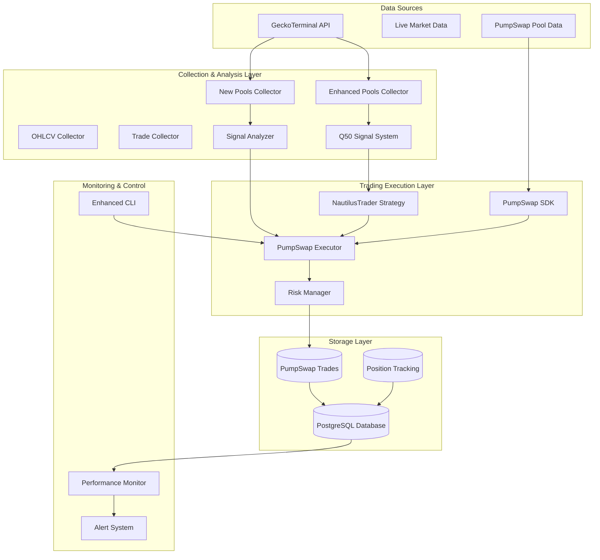

# PumpSwap SDK Integration Design

## Overview

This design integrates the PumpSwap SDK into your existing GeckoTerminal collector system and the proposed NautilusTrader POC, creating a comprehensive trading platform that can:

1. **Discover** new pools via GeckoTerminal
2. **Analyze** signals using your Q50 system
3. **Execute** trades via PumpSwap SDK
4. **Monitor** performance through NautilusTrader

## Architecture Integration

### Enhanced System Architecture with PumpSwap



## Integration Components

### 1. PumpSwap Trading Executor

```python
from pumpswap_sdk.sdk.pumpswap_sdk import PumpSwapSDK
from solders.pubkey import Pubkey
import asyncio
from decimal import Decimal
from typing import Optional, Dict, Any

class PumpSwapTradingExecutor:
    """
    Integrates PumpSwap SDK with your existing signal analysis system
    """
    
    def __init__(self, config: Dict[str, Any]):
        self.sdk = PumpSwapSDK()
        self.config = config
        self.payer_pk = config.get('payer_public_key')
        self.max_position_size = config.get('max_position_size', 0.5)
        self.min_liquidity_sol = config.get('min_liquidity_sol', 10.0)
        
    async def execute_q50_signal(self, signal_data: Dict) -> Optional[Dict]:
        """
        Execute trade based on Q50 signal analysis
        
        Args:
            signal_data: Output from your existing signal analysis system
            
        Returns:
            Trade execution result with transaction details
        """
        try:
            # Validate signal meets trading criteria
            if not self._validate_signal(signal_data):
                return None
                
            mint_address = signal_data['pool_data']['base_token_address']
            signal_strength = signal_data['signal_score']
            side = signal_data.get('side', 0)  # -1=sell, 0=hold, 1=buy
            
            if side == 1:  # Buy signal
                return await self._execute_buy(mint_address, signal_strength, signal_data)
            elif side == -1:  # Sell signal
                return await self._execute_sell(mint_address, signal_strength, signal_data)
            else:
                return {'action': 'hold', 'reason': 'No trading signal'}
                
        except Exception as e:
            return {'error': str(e), 'signal_data': signal_data}
    
    async def _execute_buy(self, mint_address: str, signal_strength: float, signal_data: Dict) -> Dict:
        """Execute buy order via PumpSwap SDK"""
        
        # Get pool data for validation
        pool_data = await self.sdk.get_pool_data(mint_address)
        if not pool_data:
            return {'error': 'Could not retrieve pool data', 'mint': mint_address}
            
        # Calculate position size based on signal strength and your existing logic
        sol_amount = self._calculate_position_size(signal_strength, signal_data)
        
        # Validate liquidity requirements
        if not self._validate_liquidity(pool_data, sol_amount):
            return {'error': 'Insufficient liquidity', 'required': sol_amount}
            
        # Execute buy via PumpSwap SDK
        result = await self.sdk.buy(
            mint=mint_address,
            sol_amount=sol_amount,
            payer_pk=self.payer_pk
        )
        
        # Store trade in your existing database
        await self._store_trade_record(result, signal_data, 'buy')
        
        return result
    
    async def _execute_sell(self, mint_address: str, signal_strength: float, signal_data: Dict) -> Dict:
        """Execute sell order via PumpSwap SDK"""
        
        # Get current position (integrate with your existing position tracking)
        position = await self._get_current_position(mint_address)
        if not position or position['amount'] <= 0:
            return {'error': 'No position to sell', 'mint': mint_address}
            
        # Calculate sell amount based on signal and position
        token_amount = self._calculate_sell_amount(position, signal_strength, signal_data)
        
        # Execute sell via PumpSwap SDK
        result = await self.sdk.sell(
            mint=mint_address,
            token_amount=token_amount,
            payer_pk=self.payer_pk
        )
        
        # Update position tracking
        await self._update_position_record(mint_address, token_amount, 'sell')
        await self._store_trade_record(result, signal_data, 'sell')
        
        return result
    
    def _calculate_position_size(self, signal_strength: float, signal_data: Dict) -> float:
        """
        Calculate position size using your existing Kelly sizing logic
        Integrates with your existing regime detection and volatility analysis
        """
        base_size = self.config.get('base_position_size', 0.1)  # 10% base
        
        # Use your existing signal strength calculation
        q50_value = abs(signal_data.get('q50', 0))
        kelly_multiplier = min(q50_value * 100, 2.0)
        
        # Apply your existing volatility regime adjustments
        vol_regime = signal_data.get('vol_regime', 'medium')
        regime_multiplier = {
            'low': 1.1,
            'medium': 1.0,
            'high': 0.85,
            'extreme': 0.6
        }.get(vol_regime, 1.0)
        
        # Calculate final position size
        position_size = base_size * kelly_multiplier * regime_multiplier
        
        # Apply maximum position limit
        return min(position_size, self.max_position_size)
    
    def _validate_signal(self, signal_data: Dict) -> bool:
        """Validate signal meets your existing trading criteria"""
        return (
            signal_data.get('tradeable', False) and
            signal_data.get('economically_significant', False) and
            signal_data.get('high_quality', False) and
            signal_data.get('signal_score', 0) >= 75.0
        )
    
    def _validate_liquidity(self, pool_data: Dict, required_sol: float) -> bool:
        """Validate pool has sufficient liquidity"""
        pool_liquidity = pool_data.get('reserve_in_usd', 0) / 100  # Rough SOL conversion
        return pool_liquidity >= max(required_sol * 10, self.min_liquidity_sol)
    
    async def _store_trade_record(self, trade_result: Dict, signal_data: Dict, action: str):
        """Store trade in your existing PostgreSQL database"""
        # Integrate with your existing database schema
        pass
    
    async def _get_current_position(self, mint_address: str) -> Optional[Dict]:
        """Get current position from your existing position tracking"""
        # Integrate with your existing position tracking system
        pass
    
    async def _update_position_record(self, mint_address: str, amount: float, action: str):
        """Update position in your existing tracking system"""
        # Integrate with your existing position management
        pass
```

### 2. Enhanced Signal Analysis with PumpSwap Integration

```python
class PumpSwapSignalAnalyzer:
    """
    Extends your existing signal analysis to include PumpSwap-specific metrics
    """
    
    def __init__(self, config: Dict):
        self.sdk = PumpSwapSDK()
        self.config = config
        
    async def analyze_pool_for_pumpswap(self, pool_data: Dict) -> Dict:
        """
        Enhance your existing signal analysis with PumpSwap-specific data
        """
        base_analysis = await self._run_existing_signal_analysis(pool_data)
        
        # Get PumpSwap-specific data
        mint_address = pool_data['base_token_address']
        
        try:
            # Get pair address and pool data from PumpSwap
            pair_address = await self.sdk.get_pair_address(mint_address)
            pumpswap_pool_data = await self.sdk.get_pool_data(mint_address)
            current_price = await self.sdk.get_token_price(pair_address)
            
            # Enhance analysis with PumpSwap data
            pumpswap_analysis = {
                'pumpswap_available': True,
                'pair_address': pair_address,
                'current_price': current_price,
                'pumpswap_liquidity': pumpswap_pool_data.get('liquidity', 0),
                'price_impact_estimate': self._estimate_price_impact(pumpswap_pool_data),
                'execution_feasibility': self._assess_execution_feasibility(pumpswap_pool_data)
            }
            
            # Combine with your existing analysis
            enhanced_analysis = {**base_analysis, **pumpswap_analysis}
            
            # Adjust signal score based on PumpSwap feasibility
            enhanced_analysis['signal_score'] = self._adjust_signal_for_pumpswap(
                base_analysis['signal_score'], 
                pumpswap_analysis
            )
            
            return enhanced_analysis
            
        except Exception as e:
            # Fallback to your existing analysis if PumpSwap data unavailable
            return {**base_analysis, 'pumpswap_available': False, 'pumpswap_error': str(e)}
    
    async def _run_existing_signal_analysis(self, pool_data: Dict) -> Dict:
        """Run your existing signal analysis system"""
        # This would call your existing NewPoolsSignalAnalyzer
        # from your current system
        pass
    
    def _estimate_price_impact(self, pool_data: Dict) -> float:
        """Estimate price impact for typical trade sizes"""
        # Calculate expected price impact based on pool liquidity
        pass
    
    def _assess_execution_feasibility(self, pool_data: Dict) -> Dict:
        """Assess whether trades can be executed effectively"""
        return {
            'can_buy': True,  # Based on pool state
            'can_sell': True,  # Based on liquidity
            'max_buy_sol': 0,  # Maximum recommended buy size
            'min_liquidity_met': True
        }
    
    def _adjust_signal_for_pumpswap(self, base_score: float, pumpswap_data: Dict) -> float:
        """Adjust signal score based on PumpSwap execution feasibility"""
        if not pumpswap_data['execution_feasibility']['can_buy']:
            return base_score * 0.5  # Reduce score if can't execute
        
        # Boost score for high liquidity pools
        liquidity_boost = min(pumpswap_data['pumpswap_liquidity'] / 1000, 1.2)
        return base_score * liquidity_boost
```

### 3. NautilusTrader Integration with PumpSwap

```python
from nautilus_trader.model.data.tick import QuoteTick
from nautilus_trader.trading.strategy import Strategy

class Q50PumpSwapStrategy(Strategy):
    """
    NautilusTrader strategy that uses Q50 signals and executes via PumpSwap
    """
    
    def __init__(self, config):
        super().__init__(config)
        self.pumpswap_executor = PumpSwapTradingExecutor(config.pumpswap_config)
        self.signal_analyzer = PumpSwapSignalAnalyzer(config.signal_config)
        
    async def on_start(self):
        """Initialize strategy with your existing data sources"""
        # Subscribe to your existing data feeds
        # Initialize connection to your PostgreSQL database
        # Load your existing Q50 signals
        pass
    
    async def on_quote_tick(self, tick: QuoteTick):
        """Process market data and execute Q50 signals via PumpSwap"""
        
        # Get current signal from your existing system
        current_signal = await self._get_current_q50_signal(tick.instrument_id)
        
        if current_signal:
            # Enhance with PumpSwap analysis
            enhanced_signal = await self.signal_analyzer.analyze_pool_for_pumpswap(
                current_signal
            )
            
            # Execute trade if signal is strong enough
            if enhanced_signal.get('tradeable', False):
                trade_result = await self.pumpswap_executor.execute_q50_signal(
                    enhanced_signal
                )
                
                # Log results for performance monitoring
                await self._log_trade_execution(trade_result, enhanced_signal)
    
    async def _get_current_q50_signal(self, instrument_id: str) -> Optional[Dict]:
        """Get current Q50 signal from your existing system"""
        # This would integrate with your existing signal loading system
        # from macro_features.pkl or your QLib integration
        pass
    
    async def _log_trade_execution(self, trade_result: Dict, signal_data: Dict):
        """Log trade execution for performance monitoring"""
        # Integrate with your existing performance monitoring system
        pass
```

## Database Schema Extensions

### PumpSwap Trading Tables

```sql
-- Extend your existing schema with PumpSwap trading tables
CREATE TABLE pumpswap_trades (
    id BIGSERIAL PRIMARY KEY,
    pool_id VARCHAR REFERENCES pools(id),
    mint_address VARCHAR NOT NULL,
    pair_address VARCHAR,
    action VARCHAR NOT NULL CHECK (action IN ('buy', 'sell')),
    
    -- Trade details
    sol_amount DECIMAL,
    token_amount DECIMAL,
    price_per_token DECIMAL,
    
    -- Signal context
    signal_score DECIMAL,
    q50_value DECIMAL,
    vol_regime VARCHAR,
    signal_strength DECIMAL,
    
    -- Execution details
    transaction_hash VARCHAR,
    block_timestamp BIGINT,
    gas_used INTEGER,
    execution_status VARCHAR,
    
    -- Performance tracking
    pnl_sol DECIMAL,
    pnl_percentage DECIMAL,
    holding_period_hours INTEGER,
    
    created_at TIMESTAMP DEFAULT CURRENT_TIMESTAMP,
    updated_at TIMESTAMP DEFAULT CURRENT_TIMESTAMP
);

CREATE TABLE pumpswap_positions (
    id BIGSERIAL PRIMARY KEY,
    mint_address VARCHAR NOT NULL UNIQUE,
    pool_id VARCHAR REFERENCES pools(id),
    
    -- Position details
    token_amount DECIMAL NOT NULL DEFAULT 0,
    average_buy_price DECIMAL,
    total_sol_invested DECIMAL NOT NULL DEFAULT 0,
    
    -- Performance metrics
    current_value_sol DECIMAL,
    unrealized_pnl_sol DECIMAL,
    unrealized_pnl_percentage DECIMAL,
    
    -- Metadata
    first_buy_at TIMESTAMP,
    last_trade_at TIMESTAMP,
    trade_count INTEGER DEFAULT 0,
    is_active BOOLEAN DEFAULT TRUE,
    
    created_at TIMESTAMP DEFAULT CURRENT_TIMESTAMP,
    updated_at TIMESTAMP DEFAULT CURRENT_TIMESTAMP
);

-- Index for performance
CREATE INDEX idx_pumpswap_trades_pool_id ON pumpswap_trades(pool_id);
CREATE INDEX idx_pumpswap_trades_timestamp ON pumpswap_trades(block_timestamp);
CREATE INDEX idx_pumpswap_positions_active ON pumpswap_positions(is_active);
```

## Enhanced CLI Commands

### PumpSwap Trading Commands

```python
# Add to your existing CLI system
@cli.group()
def pumpswap():
    """PumpSwap trading commands"""
    pass

@pumpswap.command()
@click.option('--pool-id', required=True, help='Pool ID to analyze')
@click.option('--dry-run', is_flag=True, help='Simulate trade without execution')
async def execute_signal(pool_id: str, dry_run: bool):
    """Execute Q50 signal via PumpSwap"""
    
    # Get signal from your existing system
    signal_data = await get_pool_signal_analysis(pool_id)
    
    if dry_run:
        # Simulate trade execution
        result = await simulate_pumpswap_trade(signal_data)
        click.echo(f"Simulation result: {result}")
    else:
        # Execute actual trade
        executor = PumpSwapTradingExecutor(config)
        result = await executor.execute_q50_signal(signal_data)
        click.echo(f"Trade executed: {result}")

@pumpswap.command()
@click.option('--days', default=7, help='Days of trading history')
def performance_report(days: int):
    """Generate PumpSwap trading performance report"""
    
    # Query your database for trading performance
    trades = get_pumpswap_trades_last_n_days(days)
    positions = get_active_pumpswap_positions()
    
    # Generate performance metrics
    total_pnl = sum(trade['pnl_sol'] for trade in trades)
    win_rate = len([t for t in trades if t['pnl_sol'] > 0]) / len(trades)
    
    click.echo(f"PumpSwap Trading Performance ({days} days):")
    click.echo(f"Total PnL: {total_pnl:.4f} SOL")
    click.echo(f"Win Rate: {win_rate:.2%}")
    click.echo(f"Active Positions: {len(positions)}")

@pumpswap.command()
def list_positions():
    """List current PumpSwap positions"""
    
    positions = get_active_pumpswap_positions()
    
    for position in positions:
        click.echo(f"Token: {position['mint_address']}")
        click.echo(f"Amount: {position['token_amount']}")
        click.echo(f"Unrealized PnL: {position['unrealized_pnl_sol']:.4f} SOL")
        click.echo("---")
```

## Configuration Integration

### Enhanced Config with PumpSwap

```yaml
# Add to your existing config.yaml
pumpswap:
  enabled: true
  
  # Wallet configuration
  payer_public_key: "YOUR_WALLET_PUBLIC_KEY"
  private_key_path: "/path/to/private/key"  # For signing transactions
  
  # Trading parameters
  base_position_size: 0.1  # 10% of available SOL
  max_position_size: 0.5   # Maximum 50% position
  min_liquidity_sol: 10.0  # Minimum pool liquidity requirement
  
  # Risk management
  max_slippage_percent: 5.0
  max_price_impact_percent: 10.0
  stop_loss_percent: 20.0
  take_profit_percent: 100.0
  
  # Integration settings
  integrate_with_q50: true
  integrate_with_nautilus: true
  enable_auto_trading: false  # Start with manual approval
  
  # Performance monitoring
  track_performance: true
  alert_on_large_moves: true
  daily_pnl_reporting: true

# Enhanced signal analysis with PumpSwap
signal_analysis:
  pumpswap_boost_factor: 1.2  # Boost signals for PumpSwap-available tokens
  liquidity_weight: 0.3       # Weight of liquidity in signal scoring
  execution_feasibility_weight: 0.2
```

This integration creates a powerful end-to-end system that leverages your existing proven signal analysis while adding real trading execution capabilities through PumpSwap SDK.