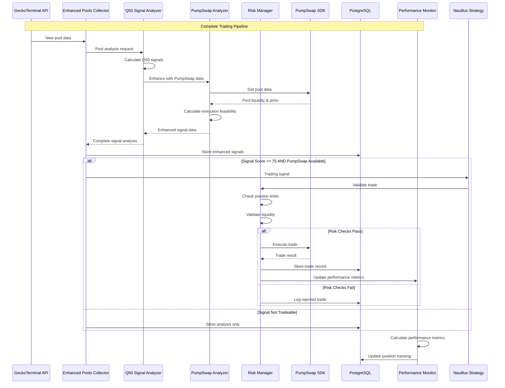

# PumpSwap Trading Strategy Integration

## Unified Trading Architecture

This document outlines how to integrate PumpSwap SDK with your existing Q50 signal system and the proposed NautilusTrader POC to create a comprehensive automated trading platform.

## Complete Trading Workflow



## Enhanced Signal Analysis with Trading Integration

### Q50PumpSwapSignalAnalyzer

```python
import asyncio
from typing import Dict, Optional, List
from decimal import Decimal
from dataclasses import dataclass
from pumpswap_sdk.sdk.pumpswap_sdk import PumpSwapSDK

@dataclass
class TradingSignal:
    """Enhanced trading signal with execution context"""
    
    # Core Q50 signals (from your existing system)
    q10: float
    q50: float
    q90: float
    signal_score: float
    tradeable: bool
    economically_significant: bool
    high_quality: bool
    side: int  # -1=sell, 0=hold, 1=buy
    
    # Regime classification (from your existing system)
    vol_regime: str
    variance_regime: str
    momentum_regime: str
    
    # Position sizing (from your existing system)
    kelly_position_size: float
    position_size_suggestion: float
    signal_strength: float
    
    # PumpSwap execution context
    pumpswap_available: bool
    pair_address: Optional[str]
    current_price: Optional[float]
    liquidity_sol: Optional[float]
    price_impact_estimate: Optional[float]
    max_buy_size_sol: Optional[float]
    execution_feasibility_score: float
    
    # Enhanced scoring
    final_signal_score: float
    execution_priority: int  # 1=high, 2=medium, 3=low
    recommended_action: str

class Q50PumpSwapSignalAnalyzer:
    """
    Enhanced signal analyzer that combines your Q50 system with PumpSwap execution analysis
    """
    
    def __init__(self, config: Dict):
        self.config = config
        self.pumpswap_sdk = PumpSwapSDK()
        
        # Your existing signal analysis components
        self.q50_signal_loader = self._initialize_q50_loader()
        self.regime_detector = self._initialize_regime_detector()
        self.technical_indicators = self._initialize_technical_indicators()
        
        # PumpSwap-specific parameters
        self.min_liquidity_sol = config.get('min_liquidity_sol', 10.0)
        self.max_price_impact = config.get('max_price_impact_percent', 10.0)
        self.liquidity_boost_factor = config.get('liquidity_boost_factor', 1.2)
        
    async def analyze_pool_for_trading(self, pool_data: Dict) -> TradingSignal:
        """
        Complete analysis combining Q50 signals with PumpSwap execution feasibility
        """
        
        # Step 1: Run your existing Q50 signal analysis
        q50_analysis = await self._run_q50_analysis(pool_data)
        
        # Step 2: Get PumpSwap execution context
        pumpswap_context = await self._analyze_pumpswap_context(pool_data)
        
        # Step 3: Combine and enhance the analysis
        trading_signal = self._create_enhanced_trading_signal(
            q50_analysis, 
            pumpswap_context, 
            pool_data
        )
        
        return trading_signal
    
    async def _run_q50_analysis(self, pool_data: Dict) -> Dict:
        """Run your existing Q50 signal analysis"""
        
        # This integrates with your existing signal analysis system
        # Load from macro_features.pkl or your QLib integration
        timestamp = pool_data.get('timestamp')
        pool_id = pool_data.get('id')
        
        # Get Q50 signals (using your existing system)
        q50_signals = await self.q50_signal_loader.get_signal_for_timestamp(timestamp)
        
        if not q50_signals:
            return self._create_default_q50_analysis()
        
        # Apply your existing regime detection
        regime_analysis = await self.regime_detector.classify_volatility_regime(
            q50_signals.get('vol_risk', 0),
            q50_signals.get('vol_raw', 0)
        )
        
        # Calculate technical indicators using your existing system
        technical_analysis = await self.technical_indicators.calculate_indicators(pool_data)
        
        return {
            'q10': q50_signals.get('q10', 0),
            'q50': q50_signals.get('q50', 0),
            'q90': q50_signals.get('q90', 0),
            'signal_score': q50_signals.get('signal_score', 0),
            'tradeable': q50_signals.get('tradeable', False),
            'economically_significant': q50_signals.get('economically_significant', False),
            'high_quality': q50_signals.get('high_quality', False),
            'side': q50_signals.get('side', 0),
            'vol_regime': regime_analysis.get('vol_regime', 'medium'),
            'variance_regime': regime_analysis.get('variance_regime', 'medium'),
            'momentum_regime': regime_analysis.get('momentum_regime', 'ranging'),
            'kelly_position_size': q50_signals.get('kelly_position_size', 0.1),
            'position_size_suggestion': q50_signals.get('position_size_suggestion', 0.1),
            'signal_strength': q50_signals.get('signal_strength', 0),
            'technical_indicators': technical_analysis
        }
    
    async def _analyze_pumpswap_context(self, pool_data: Dict) -> Dict:
        """Analyze PumpSwap execution feasibility"""
        
        mint_address = pool_data.get('base_token_address')
        if not mint_address:
            return self._create_default_pumpswap_context()
        
        try:
            # Get PumpSwap pool data
            pair_address = await self.pumpswap_sdk.get_pair_address(mint_address)
            pumpswap_pool_data = await self.pumpswap_sdk.get_pool_data(mint_address)
            current_price = await self.pumpswap_sdk.get_token_price(pair_address)
            
            # Calculate execution metrics
            liquidity_sol = self._estimate_liquidity_in_sol(pumpswap_pool_data)
            price_impact = self._estimate_price_impact(pumpswap_pool_data, 1.0)  # 1 SOL trade
            max_buy_size = self._calculate_max_buy_size(pumpswap_pool_data)
            
            # Calculate execution feasibility score
            feasibility_score = self._calculate_execution_feasibility_score(
                liquidity_sol, price_impact, max_buy_size
            )
            
            return {
                'pumpswap_available': True,
                'pair_address': pair_address,
                'current_price': current_price,
                'liquidity_sol': liquidity_sol,
                'price_impact_estimate': price_impact,
                'max_buy_size_sol': max_buy_size,
                'execution_feasibility_score': feasibility_score,
                'pumpswap_pool_data': pumpswap_pool_data
            }
            
        except Exception as e:
            return {
                'pumpswap_available': False,
                'error': str(e),
                'execution_feasibility_score': 0.0
            }
    
    def _create_enhanced_trading_signal(self, q50_analysis: Dict, pumpswap_context: Dict, pool_data: Dict) -> TradingSignal:
        """Combine Q50 and PumpSwap analysis into enhanced trading signal"""
        
        # Calculate final signal score
        base_score = q50_analysis.get('signal_score', 0)
        execution_score = pumpswap_context.get('execution_feasibility_score', 0)
        
        # Apply PumpSwap boost if available and feasible
        if pumpswap_context.get('pumpswap_available', False) and execution_score > 0.7:
            final_score = base_score * self.liquidity_boost_factor
        else:
            final_score = base_score * 0.8  # Reduce score if can't execute
        
        # Determine execution priority
        execution_priority = self._calculate_execution_priority(final_score, execution_score)
        
        # Determine recommended action
        recommended_action = self._determine_recommended_action(
            q50_analysis, pumpswap_context, final_score
        )
        
        return TradingSignal(
            # Q50 signals
            q10=q50_analysis.get('q10', 0),
            q50=q50_analysis.get('q50', 0),
            q90=q50_analysis.get('q90', 0),
            signal_score=base_score,
            tradeable=q50_analysis.get('tradeable', False),
            economically_significant=q50_analysis.get('economically_significant', False),
            high_quality=q50_analysis.get('high_quality', False),
            side=q50_analysis.get('side', 0),
            
            # Regime classification
            vol_regime=q50_analysis.get('vol_regime', 'medium'),
            variance_regime=q50_analysis.get('variance_regime', 'medium'),
            momentum_regime=q50_analysis.get('momentum_regime', 'ranging'),
            
            # Position sizing
            kelly_position_size=q50_analysis.get('kelly_position_size', 0.1),
            position_size_suggestion=q50_analysis.get('position_size_suggestion', 0.1),
            signal_strength=q50_analysis.get('signal_strength', 0),
            
            # PumpSwap context
            pumpswap_available=pumpswap_context.get('pumpswap_available', False),
            pair_address=pumpswap_context.get('pair_address'),
            current_price=pumpswap_context.get('current_price'),
            liquidity_sol=pumpswap_context.get('liquidity_sol'),
            price_impact_estimate=pumpswap_context.get('price_impact_estimate'),
            max_buy_size_sol=pumpswap_context.get('max_buy_size_sol'),
            execution_feasibility_score=execution_score,
            
            # Enhanced scoring
            final_signal_score=final_score,
            execution_priority=execution_priority,
            recommended_action=recommended_action
        )
    
    def _calculate_execution_feasibility_score(self, liquidity_sol: float, price_impact: float, max_buy_size: float) -> float:
        """Calculate execution feasibility score (0-1)"""
        
        # Liquidity score (0-1)
        liquidity_score = min(liquidity_sol / 100.0, 1.0)  # 100 SOL = perfect liquidity
        
        # Price impact score (0-1, lower impact = higher score)
        impact_score = max(0, 1.0 - (price_impact / self.max_price_impact))
        
        # Size score (0-1)
        size_score = min(max_buy_size / 10.0, 1.0)  # 10 SOL max buy = perfect
        
        # Weighted average
        return (liquidity_score * 0.4 + impact_score * 0.4 + size_score * 0.2)
    
    def _calculate_execution_priority(self, signal_score: float, execution_score: float) -> int:
        """Calculate execution priority (1=high, 2=medium, 3=low)"""
        
        combined_score = (signal_score * 0.7 + execution_score * 100 * 0.3)
        
        if combined_score >= 85:
            return 1  # High priority
        elif combined_score >= 70:
            return 2  # Medium priority
        else:
            return 3  # Low priority
    
    def _determine_recommended_action(self, q50_analysis: Dict, pumpswap_context: Dict, final_score: float) -> str:
        """Determine recommended trading action"""
        
        if not q50_analysis.get('tradeable', False):
            return 'hold'
        
        if not pumpswap_context.get('pumpswap_available', False):
            return 'monitor'  # Good signal but can't execute
        
        if final_score >= 85:
            return 'strong_buy' if q50_analysis.get('side', 0) == 1 else 'strong_sell'
        elif final_score >= 75:
            return 'buy' if q50_analysis.get('side', 0) == 1 else 'sell'
        else:
            return 'hold'
    
    # Helper methods for PumpSwap analysis
    def _estimate_liquidity_in_sol(self, pool_data: Dict) -> float:
        """Estimate pool liquidity in SOL"""
        # Convert pool liquidity to SOL equivalent
        reserve_usd = pool_data.get('reserve_in_usd', 0)
        sol_price_usd = 100  # Approximate SOL price
        return reserve_usd / sol_price_usd
    
    def _estimate_price_impact(self, pool_data: Dict, trade_size_sol: float) -> float:
        """Estimate price impact for given trade size"""
        liquidity_sol = self._estimate_liquidity_in_sol(pool_data)
        if liquidity_sol == 0:
            return 100.0  # 100% impact if no liquidity
        
        # Simple price impact model
        impact_percentage = (trade_size_sol / liquidity_sol) * 100
        return min(impact_percentage, 100.0)
    
    def _calculate_max_buy_size(self, pool_data: Dict) -> float:
        """Calculate maximum recommended buy size"""
        liquidity_sol = self._estimate_liquidity_in_sol(pool_data)
        # Max 10% of liquidity or 10 SOL, whichever is smaller
        return min(liquidity_sol * 0.1, 10.0)
    
    def _create_default_q50_analysis(self) -> Dict:
        """Create default Q50 analysis when signals unavailable"""
        return {
            'q10': 0, 'q50': 0, 'q90': 0,
            'signal_score': 0, 'tradeable': False,
            'economically_significant': False, 'high_quality': False,
            'side': 0, 'vol_regime': 'medium', 'variance_regime': 'medium',
            'momentum_regime': 'ranging', 'kelly_position_size': 0,
            'position_size_suggestion': 0, 'signal_strength': 0
        }
    
    def _create_default_pumpswap_context(self) -> Dict:
        """Create default PumpSwap context when unavailable"""
        return {
            'pumpswap_available': False,
            'execution_feasibility_score': 0.0
        }
    
    # Initialize your existing components
    def _initialize_q50_loader(self):
        """Initialize your existing Q50 signal loader"""
        # This would initialize your existing signal loading system
        pass
    
    def _initialize_regime_detector(self):
        """Initialize your existing regime detector"""
        # This would initialize your existing regime detection system
        pass
    
    def _initialize_technical_indicators(self):
        """Initialize your existing technical indicators"""
        # This would initialize your existing technical indicators system
        pass
```

## Automated Trading Strategy

### Complete Trading Strategy Implementation

```python
from nautilus_trader.trading.strategy import Strategy
from nautilus_trader.model.data.tick import QuoteTick
from nautilus_trader.model.orders import MarketOrder
from nautilus_trader.model.enums import OrderSide
import asyncio
from typing import Dict, List, Optional

class Q50PumpSwapAutomatedStrategy(Strategy):
    """
    Complete automated trading strategy combining Q50 signals with PumpSwap execution
    """
    
    def __init__(self, config):
        super().__init__(config)
        
        # Initialize components
        self.signal_analyzer = Q50PumpSwapSignalAnalyzer(config.signal_config)
        self.pumpswap_executor = PumpSwapTradingExecutor(config.pumpswap_config)
        self.risk_manager = TradingRiskManager(config.risk_config)
        self.performance_monitor = TradingPerformanceMonitor(config.monitoring_config)
        
        # Trading state
        self.active_positions: Dict[str, Dict] = {}
        self.pending_orders: Dict[str, Dict] = {}
        self.last_signal_check = 0
        
        # Configuration
        self.signal_check_interval = config.get('signal_check_interval_seconds', 300)  # 5 minutes
        self.max_concurrent_positions = config.get('max_concurrent_positions', 5)
        self.enable_auto_trading = config.get('enable_auto_trading', False)
        
    async def on_start(self):
        """Initialize strategy"""
        self.log.info("Starting Q50 PumpSwap Automated Strategy")
        
        # Initialize database connections
        await self._initialize_database_connections()
        
        # Load existing positions
        await self._load_existing_positions()
        
        # Subscribe to your existing data feeds
        await self._subscribe_to_data_feeds()
        
        # Start signal monitoring
        if self.enable_auto_trading:
            self._schedule_signal_monitoring()
    
    async def on_quote_tick(self, tick: QuoteTick):
        """Process market data ticks"""
        
        # Update position values
        await self._update_position_values(tick)
        
        # Check for stop-loss/take-profit triggers
        await self._check_exit_conditions(tick)
        
        # Periodic signal analysis
        current_time = self.clock.timestamp()
        if current_time - self.last_signal_check > self.signal_check_interval:
            await self._run_signal_analysis()
            self.last_signal_check = current_time
    
    async def _run_signal_analysis(self):
        """Run complete signal analysis and execute trades"""
        
        try:
            # Get pools to analyze (from your existing system)
            pools_to_analyze = await self._get_pools_for_analysis()
            
            # Analyze each pool
            trading_signals = []
            for pool_data in pools_to_analyze:
                signal = await self.signal_analyzer.analyze_pool_for_trading(pool_data)
                if signal.recommended_action in ['strong_buy', 'buy', 'strong_sell', 'sell']:
                    trading_signals.append((pool_data, signal))
            
            # Sort by execution priority
            trading_signals.sort(key=lambda x: x[1].execution_priority)
            
            # Execute trades
            for pool_data, signal in trading_signals:
                if len(self.active_positions) >= self.max_concurrent_positions:
                    break
                
                await self._execute_trading_signal(pool_data, signal)
                
        except Exception as e:
            self.log.error(f"Error in signal analysis: {e}")
    
    async def _execute_trading_signal(self, pool_data: Dict, signal: TradingSignal):
        """Execute a trading signal"""
        
        mint_address = pool_data.get('base_token_address')
        
        # Skip if already have position
        if mint_address in self.active_positions:
            return
        
        # Risk management validation
        risk_check = await self.risk_manager.validate_trade(signal, pool_data)
        if not risk_check['approved']:
            self.log.info(f"Trade rejected by risk manager: {risk_check['reason']}")
            return
        
        # Execute trade via PumpSwap
        try:
            if signal.recommended_action in ['strong_buy', 'buy']:
                trade_result = await self._execute_buy_signal(pool_data, signal)
            elif signal.recommended_action in ['strong_sell', 'sell']:
                trade_result = await self._execute_sell_signal(pool_data, signal)
            else:
                return
            
            # Track trade execution
            if trade_result and trade_result.get('success'):
                await self._track_new_position(mint_address, trade_result, signal)
                await self.performance_monitor.log_trade_execution(trade_result, signal)
                
        except Exception as e:
            self.log.error(f"Error executing trade for {mint_address}: {e}")
    
    async def _execute_buy_signal(self, pool_data: Dict, signal: TradingSignal) -> Optional[Dict]:
        """Execute buy signal via PumpSwap"""
        
        mint_address = pool_data.get('base_token_address')
        
        # Calculate position size
        position_size_sol = self._calculate_final_position_size(signal)
        
        # Execute via PumpSwap SDK
        trade_result = await self.pumpswap_executor.sdk.buy(
            mint=mint_address,
            sol_amount=position_size_sol,
            payer_pk=self.pumpswap_executor.payer_pk
        )
        
        self.log.info(f"Buy executed: {mint_address}, Size: {position_size_sol} SOL")
        return trade_result
    
    async def _execute_sell_signal(self, pool_data: Dict, signal: TradingSignal) -> Optional[Dict]:
        """Execute sell signal via PumpSwap"""
        
        mint_address = pool_data.get('base_token_address')
        
        # Get current position
        position = self.active_positions.get(mint_address)
        if not position:
            return None
        
        # Calculate sell amount
        sell_amount = position['token_amount'] * 0.5  # Sell 50% for partial exit
        
        # Execute via PumpSwap SDK
        trade_result = await self.pumpswap_executor.sdk.sell(
            mint=mint_address,
            token_amount=sell_amount,
            payer_pk=self.pumpswap_executor.payer_pk
        )
        
        self.log.info(f"Sell executed: {mint_address}, Amount: {sell_amount}")
        return trade_result
    
    def _calculate_final_position_size(self, signal: TradingSignal) -> float:
        """Calculate final position size combining Q50 and risk management"""
        
        # Start with Q50 position size suggestion
        base_size = signal.position_size_suggestion
        
        # Apply execution feasibility adjustment
        execution_adjustment = signal.execution_feasibility_score
        
        # Apply signal strength multiplier
        strength_multiplier = min(signal.final_signal_score / 75.0, 2.0)
        
        # Calculate final size
        final_size = base_size * execution_adjustment * strength_multiplier
        
        # Apply maximum limits
        max_position = self.risk_manager.get_max_position_size()
        return min(final_size, max_position)
    
    async def _track_new_position(self, mint_address: str, trade_result: Dict, signal: TradingSignal):
        """Track new position"""
        
        self.active_positions[mint_address] = {
            'mint_address': mint_address,
            'token_amount': trade_result.get('token_amount', 0),
            'sol_invested': trade_result.get('sol_amount', 0),
            'entry_price': trade_result.get('price_per_token', 0),
            'entry_time': self.clock.timestamp(),
            'signal_data': signal,
            'stop_loss_price': self._calculate_stop_loss_price(trade_result, signal),
            'take_profit_price': self._calculate_take_profit_price(trade_result, signal)
        }
    
    async def _check_exit_conditions(self, tick: QuoteTick):
        """Check stop-loss and take-profit conditions"""
        
        for mint_address, position in list(self.active_positions.items()):
            current_price = await self._get_current_price(mint_address)
            if not current_price:
                continue
            
            # Check stop-loss
            if current_price <= position['stop_loss_price']:
                await self._execute_stop_loss(mint_address, position)
            
            # Check take-profit
            elif current_price >= position['take_profit_price']:
                await self._execute_take_profit(mint_address, position)
    
    # Additional helper methods...
    async def _get_pools_for_analysis(self) -> List[Dict]:
        """Get pools from your existing system for analysis"""
        # This would query your existing database for pools to analyze
        pass
    
    async def _initialize_database_connections(self):
        """Initialize connections to your existing database"""
        pass
    
    async def _load_existing_positions(self):
        """Load existing positions from database"""
        pass
    
    async def _subscribe_to_data_feeds(self):
        """Subscribe to your existing data feeds"""
        pass
    
    def _schedule_signal_monitoring(self):
        """Schedule periodic signal monitoring"""
        pass
    
    async def _update_position_values(self, tick: QuoteTick):
        """Update position values based on current prices"""
        pass
    
    async def _get_current_price(self, mint_address: str) -> Optional[float]:
        """Get current price for token"""
        pass
    
    def _calculate_stop_loss_price(self, trade_result: Dict, signal: TradingSignal) -> float:
        """Calculate stop-loss price"""
        entry_price = trade_result.get('price_per_token', 0)
        stop_loss_percent = 0.20  # 20% stop-loss
        return entry_price * (1 - stop_loss_percent)
    
    def _calculate_take_profit_price(self, trade_result: Dict, signal: TradingSignal) -> float:
        """Calculate take-profit price"""
        entry_price = trade_result.get('price_per_token', 0)
        take_profit_percent = 1.0  # 100% take-profit
        return entry_price * (1 + take_profit_percent)
    
    async def _execute_stop_loss(self, mint_address: str, position: Dict):
        """Execute stop-loss order"""
        pass
    
    async def _execute_take_profit(self, mint_address: str, position: Dict):
        """Execute take-profit order"""
        pass
```

This comprehensive integration creates a complete automated trading system that:

1. **Discovers** opportunities using your existing GeckoTerminal collection
2. **Analyzes** signals using your proven Q50 system
3. **Validates** execution feasibility via PumpSwap
4. **Executes** trades automatically with risk management
5. **Monitors** performance and manages positions
6. **Integrates** seamlessly with your existing infrastructure

The system maintains your proven signal analysis while adding real trading execution capabilities through the PumpSwap SDK.